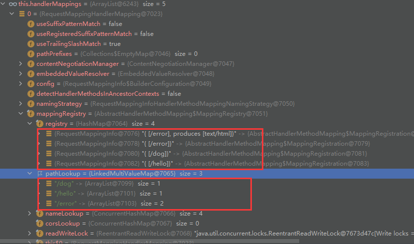

# 1.SpringBoot概览

## 1.1 Spring 的能力

1. 微服务(Microservices)
2. 响应式开发
3. 分布式开发(Spring Cloud)
4. Web开发(Spring MVC)
5. Serverless (无服务开发/函数式服务)
6. 事件驱动，结合分布式系统

> 为什么用SpringBoot—
> 能快速创建出生产级别的Spring应用

1. Create stand-alone Spring applications
   创建独立Spring应用
2. Embed Tomcat, Jetty or Undertow directly (no need to deploy WAR files)
   内嵌web服务器
3. Provide opinionated ‘starter’ dependencies to simplify your build configuration
   自动starter依赖，简化构建配置
4. Automatically configure Spring and 3rd party libraries whenever possible
   自动配置Spring以及第三方功能
5. Provide production-ready features such as metrics, health checks, and externalized configuration
   提供生产级别的监控、健康检查及外部化配置
6. Absolutely no code generation and no requirement for XML configuration
   无代码生成、无需编写XML
7. SpringBoot是整合Spring技术栈的一站式框架
8. SpringBoot是简化Spring技术栈的快速开发脚手架

## 1.2 SpringBoot应用入口

```
* SpringBoot Web应用入口启动类,引导加载自动配置类
@SpringBootApplication()
public class MainApplication {

    public static void main(String[] args) {

    }
}
```

`@SpringBootApplication 注解阐释`

```
@Target(ElementType.TYPE)
@Retention(RetentionPolicy.RUNTIME)
@Documented
@Inherited
@SpringBootConfiguration
@EnableAutoConfiguration
@ComponentScan(excludeFilters = { @Filter(type = FilterType.CUSTOM, classes = TypeExcludeFilter.class),
@Filter(type = FilterType.CUSTOM, classes = AutoConfigurationExcludeFilter.class) })
public @interface SpringBootApplication {

}

@Target(ElementType.TYPE)
@Retention(RetentionPolicy.RUNTIME)
@Documented
@Inherited
@AutoConfigurationPackage
@Import(AutoConfigurationImportSelector.class)
public @interface EnableAutoConfiguration {

}
```

* @SpringBootApplication 配置类，自动配置如何生效
  - @ComponentScan(excludeFilters = { @Filter(type = FilterType.CUSTOM, classes = TypeExcludeFilter.class),
  - @Filter(type = FilterType.CUSTOM, classes = AutoConfigurationExcludeFilter.class) })  包扫描注解，自定义扫描器
  - @EnableAutoConfiguration 开启自动配置
    - @AutoConfigurationPackage 自动配置包
    - @Import(AutoConfigurationPackages.Registrar.class) Registrar给容器中 某个包下的组件批量注册（MainApplication）
    - @Import(AutoConfigurationImportSelector.class)

      1. 利用getAutoConfigurationEntry(annotationMetadata);给容器中批量导入一些组件
      2. 调用List<String> configurations = AutoConfigurationImportSelector.getCandidateConfigurations(annotationMetadata, attributes)获取到所有需要导入到容器中的配置类
      3. 利用工厂加载 Map<String, List<String>> SpringFactoriesLoader.loadFactoryNames() 得到所有的组件
      4. classLoader.getResources(FACTORIES_RESOURCE_LOCATION)  从META-INF/spring.factories位置来加载所有配置文件
         - 默认扫描我们当前系统里面所有META-INF/spring.factories位置的文件
         - spring-boot-autoconfigure-2.3.4.RELEASE.jar包里面也有META-INF/spring.factories

      > org\springframework\boot\spring-boot\2.7.1\spring-boot-2.7.1.jar!\META-INF\spring.factories
      > org\springframework\boot\spring-boot-autoconfigure\2.7.1\spring-boot-autoconfigure-2.7.1.jar!\META-INF\spring.factories
      >

      `spring.factories文件里面配置了spring-boot启动时就要给容器中加载的所有配置类,但是最终会按照条件装配规则按需配置 xxxxAutoConfiguration(如BatchAutoConfiguration、CacheAutoConfiguration) @Conditional  @ConditionalOnClass(LocalContainerEntityManagerFactoryBean.class， @ConditionalOnBean(AbstractEntityManagerFactoryBean.class`

      ```java
      @AutoConfiguration
      //当项目引入了RabbitMq消息队列组件该配置类才会生效
      @ConditionalOnClass({ RabbitTemplate.class, Channel.class }) 
      @EnableConfigurationProperties(RabbitProperties.class)
      @Import({ RabbitAnnotationDrivenConfiguration.class, RabbitStreamConfiguration.class })
      public class RabbitAutoConfiguration {

      }
      ```

## 1.3 自动配置的条件装配规则

> org.springframework.boot.autoconfigure.web.servlet.DispatcherServletAutoConfiguration
> Web-Servlet 自动配置类，Spring-MVC 请求分发相关配置`

```java
@AutoConfigureOrder(Ordered.HIGHEST_PRECEDENCE) //装配最高优先级
//指定装配优先级在 ServletWebServerFactoryAutoConfiguration.class之后
@AutoConfiguration(after = ServletWebServerFactoryAutoConfiguration.class) 
@ConditionalOnWebApplication(type = Type.SERVLET)
@ConditionalOnClass(DispatcherServlet.class)
public class DispatcherServletAutoConfiguration {

    @ConditionalOnClass(ServletRegistrion.class)//当容器中有该组件时装配(tomcat包中已包含)
    @EnableConfigurationProperties(WebMvcPropeies.class)//开启该配置类绑定该配置文件功能 spring.mvc
    protected static class DispatcherServletConfiguration {

        @Bean
        @ConditionalOnBean(Multipartolver.class)
        @ConditionalOnMissingBean(name = DispatcherServlet.MULTIPART_RESOLVER_BEAN_NAME) 如果用户没有配置该组件，则将该bean 注册到容器中
        public MultipartResolver multipartResolver(MultipartResolver resolver) {
            // Detect if the user has created a MultipartResolver but named it incorrectly
            return resolver;
        }
    }
}
  
//配置属性前缀为 spring.mvc
@ConfigurationProperties(prefix = "spring.mvc")
public class WebMvcProperties {}
```

> org.springframework.boot.autoconfigure.aop.AopAutoConfiguration
> Aop自动配置类

```java
@AutoConfiguration
//当配置文件中配置了spring.aop.name，并且配置值为true时该装配生效。当未配置时，该值也为true
@ConditionalOnProperty(prefix = "spring.aop", name = "auto", havingValue = "true", matchIfMissing = true)
public class AopAutoConfiguration {

    @Configuration(proxyBeanMethods = false)
    @ConditionalOnClass(Advice.class) //当容器中存在该类时生效
    static class AspectJAutoProxyingConfiguration {

        @Configuration(proxyBeanMethods = false)
        @EnableAspectJAutoProxy(proxyTargetClass = false)
        @ConditionalOnProperty(prefix = "spring.aop", name = "proxy-target-class", havingValue = "false")
        static class JdkDynamicAutoProxyConfiguration { }

        @Configuration(proxyBeanMethods = false)
        @EnableAspectJAutoProxy(proxyTargetClass = true)
        @ConditionalOnProperty(prefix = "spring.aop", name = "proxy-target-class", havingValue = "true",
                matchIfMissing = true)
        static class CglibAutoProxyConfiguration { }
    }

    @Configuration(proxyBeanMethods = false)
    @ConditionalOnMissingClass("org.aspectj.weaver.Advice") //当容器中缺少Advice.class类时生效
    //当配置文件中配置了spring.aop.proxy-target-class，并且配置值为true时该装配生效。当未配置时，该值也为true
    @ConditionalOnProperty(prefix = "spring.aop", name = "proxy-target-class", havingValue = "true",
            matchIfMissing = true) 
    static class ClassProxyingConfiguration {

        //配置简单的Aop功能
        @Bean
        static BeanFactoryPostProcessor forceAutoProxyCreatorToUseClassProxying() {
            return (beanFactory) -> {
                if (beanFactory instanceof BeanDefinitionRegistry) {
                    BeanDefinitionRegistry registry = (BeanDefinitionRegistry) beanFactory;
                    AopConfigUtils.registerAutoProxyCreatorIfNecessary(registry);
                    AopConfigUtils.forceAutoProxyCreatorToUseClassProxying(registry);
                }
            };
        }

    }
}
```

> 总结：https://spring.io/projects/spring-boot

* SpringBoot先加载所有的自动配置类  xxxxxAutoConfiguration
  + org\springframework\boot\spring-boot\2.7.1\spring-boot-2.7.1.jar!\META-INF\spring.factories
  + org\springframework\boot\spring-boot-autoconfigure\2.7.1\spring-boot-autoconfigure-2.7.1.jar!\META-INF\spring.factories
* 每个自动配置类按照条件装配规则生效，默认都会绑定配置文件指定的值。xxxxProperties里面拿。xxxProperties和配置文件进行了绑定
* 生效的配置类就会给容器中装配很多组件
* 只要容器中有这些组件，相当于这些功能就有了
* 定制化配置
  + 用户直接自己@Bean替换底层的组件
  + 用户去看这个组件是获取的配置文件什么值就去修改。xxxxxAutoConfiguration ---> 组件  ---> xxxxProperties里面拿值  ----> application.properties 修改对应属性

## 1.4 注解的阐释

`注解可理解为释义说明，标记或标签，如类/属性/方法的说明。根据定义的不同，可在运行时或编译时被忽略或一直保存。`

`通常由反射获取该类上的注解信息，并以其作为初始配置信息做相应处理`

```java
@Retention(RetentionPolicy.RUNTIME)
public @interface CatAnnotations {

    int age() default 1;
    String name() default "";
}

@CatAnnotations(name = "cat class")//注解 修饰类
public class Cat {

    private String eatFood;
  
    @CatAnnotations(age = 10,name = "cat")//注解 修饰属性
    private String name;

    @CatAnnotations(name = "cat construtor")//注解 修饰构造器
    public Cat(String eatFood, String name) {
        this.eatFood = eatFood;
        this.name = name;
    }

    public String getEatFood() {
        return eatFood;
    }

    public void setEatFood(String eatFood) {
        this.eatFood = eatFood;
    }

    @CatAnnotations(name = "cat name")//注解 修饰方法
    public String getName() {
        return name;
    }

    public void setName(String name) {
        this.name = name;
    }
}

    public static void main(String[] args) throws NoSuchFieldException, NoSuchMethodException {

        //获取Cat class 实例
        Class<Cat> catClass = Cat.class;

        //反射获取 类上的注解
        TestAnnotations classAnnotation = catClass.getAnnotation(CatAnnotations.class);
        System.out.println("annotions:" + classAnnotation.age());
        System.out.println("annotions:" + classAnnotation.name());

        //反射获取 private属性上的注解
        Field name = catClass.getDeclaredField("name");
        CatAnnotations fieldAnnotation = name.getAnnotation(CatAnnotations.class);
        System.out.println("annotions-name:" + fieldAnnotation);
        //反射获取 方法上的注解
        Method me = catClass.getMethod("getName",null);
        CatAnnotations methodAnnotation = me.getAnnotation(CatAnnotations.class);

    }
```

> 总结：注解如何使用

* 编译器可以利用注解来探测错误和检查信息，像@override检查是否重写
* 适合工具类型的软件用的，避免繁琐的代码，生成代码配置，比如jpa自动生成sql,日志注解，权限控制
* 程序运行时的处理： 某些注解可以在程序运行的时候，通过反射获取被代码所读取，因此我们可以自定义注解做一些初始配置为代码逻辑做支持

# 2.SpringMVC

## 2.1 SpringMVC概述

> Spring Boot provides auto-configuration for Spring MVC that works well with most applications.(大多场景我们都无需自定义配置)
> The auto-configuration adds the following features on top of Spring’s defaults: (自动配置在 Spring 的默认值之上添加了以下特性：)

* ● Inclusion of ContentNegotiatingViewResolver and BeanNameViewResolver beans.
* ○ 内容协商视图解析器和BeanName视图解析器
* ● Support for serving static resources, including support for WebJars (covered later in this document)).
* ○ 静态资源（包括webjars）
* ● Automatic registration of Converter, GenericConverter, and Formatter beans.
* ○ 自动注册 Converter，GenericConverter，Formatter
* ● Support for HttpMessageConverters (covered later in this document).
* ○ 支持 HttpMessageConverters （后来我们配合内容协商理解原理）
* ● Automatic registration of MessageCodesResolver (covered later in this document).
* ○ 自动注册 MessageCodesResolver （国际化用）
* ● Static index.html support.
* ○ 静态index.html 页支持
* ● Custom Favicon support (covered later in this document).
* ○ 自定义 Favicon
* ● Automatic use of a ConfigurableWebBindingInitializer bean (covered later in this document).
* ○ 自动使用 ConfigurableWebBindingInitializer ，（DataBinder负责将请求数据绑定到JavaBean上）

1. If you want to keep those Spring Boot MVC customizations and make more MVC customizations (interceptors, formatters,view controllers, and other features), you can add your own @Configuration class of type WebMvcConfigurer but without @EnableWebMvc.
   不用@EnableWebMvc注解。使用 @Configuration + WebMvcConfigurer 自定义规则
2. If you want to provide custom instances of RequestMappingHandlerMapping, RequestMappingHandlerAdapter, or ExceptionHandlerExceptionResolver,and still keep the Spring Boot MVC customizations, you can declare a bean of type WebMvcRegistrations and use it to provide custom instances of those components.
   声明 WebMvcRegistrations 改变默认底层组件
3. If you want to take complete control of Spring MVC, you can add your own @Configuration annotated with @EnableWebMvc,or alternatively add your own @Configuration-annotated DelegatingWebMvcConfiguration as described in the Javadoc of @EnableWebMvc.
   使用 @EnableWebMvc+@Configuration+DelegatingWebMvcConfiguration 全面接管SpringMVC

## 2.2.静态资源访问

> [classpath [META-INF/resources/], classpath [resources/], classpath [static/], classpath [public/], ServletContext [/]]
> 2022-08-04 16:07:22.954 DEBUG 25196 --- [nio-8080-exec-1] o.s.web.servlet.DispatcherServlet        : Completed 200 OK

只要静态资源放在资源路径下： resources/static (or /public or /resources or /META-INF/resources)
访问: 当前项目根路径/ + 静态资源名

原理: 静态映射/**

`spring.mvc.static-path-pattern 属性资源映射调整`

`spring.web.resources.static-locations 属性自定义静态资源位置`

请求进来，DispatcherServlet 分发处理，先去找Controller看能不能处理。不能处理的所有请求又都交给静态资源处理器。静态资源也找不到则响应404页面

欢迎页支持

`静态资源路径下  index.html`

网站图标支持
`'favicon.ico 放在静态资源目录下即可`

## 2.3 静态资源配置原理(WebMvcAutoConfiguration)

* org.springframework.boot.autoconfigure.web.servlet.WebMvcAutoConfiguration
* SpringBoot启动默认加载  xxxAutoConfiguration 类（自动配置类）

```java
@ConditionalOnWebApplication(type = Type.SERVLET)
@ConditionalOnClass({ Servlet.class, DispatcherServlet.class, WebMvcConfigurer.class })
@ConditionalOnMissingBean(WebMvcConfigurationSupport.class) //当容器中缺少 WebMvcConfigurationSupport 组件时生效，该组件用于自定义MVC配置
@AutoConfigureOrder(Ordered.HIGHEST_PRECEDENCE + 10)
@AutoConfigureAfter({ DispatcherServletAutoConfiguration.class, TaskExecutionAutoConfiguration.class,
ValidationAutoConfiguration.class })
public class WebMvcAutoConfiguration {}
```

* 给容器中配了什么

```java
@Configuration(proxyBeanMethods = false)
@Import(EnableWebMvcConfiguration.class)
@EnableConfigurationProperties({ WebMvcProperties.class, ResourceProperties.class }) //配置属性
@Order(0)
public static class WebMvcAutoConfigurationAdapter implements WebMvcConfigurer {}
```

* 配置文件的相关属性和xxx进行了绑定

`WebMvcProperties==spring.mvc    WebProperties==spring.web`

```java
//配置类只有一个有参构造器，有参构造器所有参数的值都会从容器中确定
//WebProperties webProperties；获取和spring.web绑定的所有的值的对象
//WebMvcProperties mvcProperties 获取和spring.mvc绑定的所有的值的对象
//ListableBeanFactory beanFactory Spring的beanFactory
//HttpMessageConverters 找到所有的HttpMessageConverters  Http请求和响应处理
//ResourceHandlerRegistrationCustomizer 找到 资源处理器的自定义器。=========
//DispatcherServletPath  处理分发器
//ServletRegistrationBean   给应用注册Servlet、Filter....
public WebMvcAutoConfigurationAdapter(WebProperties webProperties, WebMvcProperties mvcProperties,
                  ListableBeanFactory beanFactory, ObjectProvider<HttpMessageConverters> messageConvertersProvider,
                  ObjectProvider<ResourceHandlerRegistrationCustomizer> resourceHandlerRegistrationCustomizerProvider,
                  ObjectProvider<DispatcherServletPath> dispatcherServletPath,
                  ObjectProvider<ServletRegistrationBean<?>> servletRegistrations) {
    this.resourceProperties = resourceProperties;
    this.mvcProperties = mvcProperties;
    this.beanFactory = beanFactory;
    this.messageConvertersProvider = messageConvertersProvider;
    this.resourceHandlerRegistrationCustomizer = resourceHandlerRegistrationCustomizerProvider.getIfAvailable();
    this.dispatcherServletPath = dispatcherServletPath;
    this.servletRegistrations = servletRegistrations;
}
```

```java
//资源处理的默认规则
//CLASSPATH_RESOURCE_LOCATIONS = { "classpath:/META-INF/resources/", "classpath:/resources/", "classpath:/static/", "classpath:/public/" }
public void addResourceHandlers(ResourceHandlerRegistry registry) {
    if (!this.resourceProperties.isAddMappings()) {
        logger.debug("Default resource handling disabled");
        return;
    }
    //webjars的规则
    addResourceHandler(registry, "/webjars/**", "classpath:/META-INF/resources/webjars/");
    addResourceHandler(registry, this.mvcProperties.getStaticPathPattern(), (registration) -> {
        registration.addResourceLocations(this.resourceProperties.getStaticLocations());
        if (this.servletContext != null) {
            ServletContextResource resource = new ServletContextResource(this.servletContext, SERVLET_LOCATION);
            registration.addResourceLocations(resource);
        }
    });
}
```

```java
//HandlerMapping：定义请求和处理响应对象之间的映射处理器。保存了每一个Handler能处理哪些请求。
//WelcomePageHandlerMapping 欢迎页响应处理(/index.hteml)
@Bean
public WelcomePageHandlerMapping welcomePageHandlerMapping(ApplicationContext applicationContext,
                                                           FormattingConversionService mvcConversionService, ResourceUrlProvider mvcResourceUrlProvider) {
    WelcomePageHandlerMapping welcomePageHandlerMapping = new WelcomePageHandlerMapping(
            new TemplateAvailabilityProviders(applicationContext), applicationContext, getWelcomePage(),
            this.mvcProperties.getStaticPathPattern());
    welcomePageHandlerMapping.setInterceptors(getInterceptors(mvcConversionService, mvcResourceUrlProvider));
    welcomePageHandlerMapping.setCorsConfigurations(getCorsConfigurations());
    return welcomePageHandlerMapping;
}

WelcomePageHandlerMapping(TemplateAvailabilityProviders templateAvailabilityProviders,
                          ApplicationContext applicationContext, org.springframework.core.io.Resource welcomePage, String staticPathPattern) {
    if (welcomePage != null && "/**".equals(staticPathPattern)) {
        logger.info("Adding welcome page: " + welcomePage);
        setRootViewName("forward:index.html");
    }
    else if (welcomeTemplateExists(templateAvailabilityProviders, applicationContext)) {
        logger.info("Adding welcome page template: index");
        setRootViewName("index");
    }
}
```

# 3.请求参数处理(Rest)

## 3.1 WebMvcAutoConfiguration-HiddenHttpMethodFilter-隐藏http方法过滤器

> org.springframework.boot.autoconfigure.web.servlet.WebMvcAutoConfiguration

* @xxxMapping
* Rest风格支持（使用HTTP请求方式动词来表示对资源的操作）
  ○ 以前：/getUser   获取用户     /deleteUser 删除用户    /editUser  修改用户       /saveUser 保存用户
  ○ 现在： /user    GET-获取用户    DELETE-删除用户     PUT-修改用户      POST-保存用户
  ○ 核心Filter HiddenHttpMethodFilter

`手动配置开启-spring.mvc.hiddenmethod.filter.enabled=true`

* 用法: 表单method=put, 隐藏域 _method=put 

```java
//WebMvcAutoConfiguration中配置
@Bean
@ConditionalOnMissingBean(HiddenHttpMethodFilter.class)
@ConditionalOnProperty(prefix = "spring.mvc.hiddenmethod.filter", name = "enabled")
public OrderedHiddenHttpMethodFilter hiddenHttpMethodFilter() {
    return new OrderedHiddenHttpMethodFilter();
}

//http方法过滤器
public class HiddenHttpMethodFilter extends OncePerRequestFilter {

    private static final List<String> ALLOWED_METHODS =
            Collections.unmodifiableList(Arrays.asList(HttpMethod.PUT.name(),
                    HttpMethod.DELETE.name(), HttpMethod.PATCH.name()));

    /** Default method parameter: {@code _method}. */
    public static final String DEFAULT_METHOD_PARAM = "_method";

    private String methodParam = DEFAULT_METHOD_PARAM;

    //方法过滤
    @Override
    protected void doFilterInternal(HttpServletRequest request, HttpServletResponse response, FilterChain filterChain)
            throws ServletException, IOException {
        HttpServletRequest requestToUse = request;
        if ("POST".equals(request.getMethod()) && request.getAttribute(WebUtils.ERROR_EXCEPTION_ATTRIBUTE) == null) {
            String paramValue = request.getParameter(this.methodParam);
            if (StringUtils.hasLength(paramValue)) {
                String method = paramValue.toUpperCase(Locale.ENGLISH);
                if (ALLOWED_METHODS.contains(method)) {
                    requestToUse = new HttpMethodRequestWrapper(request, method);
                }
            }
        }
        filterChain.doFilter(requestToUse, response);
    }
}
```

## 3.2 Rest原理（from表单提交要使用REST的时候）(ServletRequestWrapper)

* 主流浏览器from表单请求时，只支持get/post请求，不支持rest风格请求
* 欲支持rest风格请求时，在表单提交中带上带上参数_method，指定rest请求方式(PUT/DELETE)
* 请求过来被HiddenHttpMethodFilter拦截
* 请求是否正常，并且请求方式是POST
* 获取到表单中_method的值
* 兼容以下请求: PUT.DELETE.PATCH
* 原生的使用了post请求的request，通过包装模式requestWrapper重写了getMethod方法，传递_method参数，getMethod方法返回的是新rest请求方式
* 过滤器链放行的时候用wrapper，调用getMethod方法识别当前请求方式则会调用requestWrapper的，返回传入的_method参数
* 从而匹配到对应的rest 请求处理方法

> Rest使用客户端工具/api请求(如安卓请求)，如PostMan直接发送put、delete等方式请求，无需Filter。因为request请求可指定rest请求方式

```java
public class WebMvcAutoConfiguration {
    ...
    //配置表单支持rest提交 _method参数是否隐藏，默认false
    @Bean
    @ConditionalOnMissingBean(HiddenHttpMethodFilter.class)
    @ConditionalOnProperty(prefix = "spring.mvc.hiddenmethod.filter", name = "enabled")
    public OrderedHiddenHttpMethodFilter hiddenHttpMethodFilter() {
        return new OrderedHiddenHttpMethodFilter();
    }
}

public class HiddenHttpMethodFilter extends OncePerRequestFilter {

    private static final List<String> ALLOWED_METHODS =
            Collections.unmodifiableList(Arrays.asList(HttpMethod.PUT.name(),
                    HttpMethod.DELETE.name(), HttpMethod.PATCH.name()));

    /** 
     * Default method parameter: {@code _method}. 
     **/
    public static final String DEFAULT_METHOD_PARAM = "_method";

    private String methodParam = DEFAULT_METHOD_PARAM;
    
    //当配置生效时
    ...
    @Override
    protected void doFilterInternal(HttpServletRequest request, HttpServletResponse response, FilterChain filterChain)
            throws ServletException, IOException {

        HttpServletRequest requestToUse = request;
        //请求方式是post 并且没有错误
        if ("POST".equals(request.getMethod()) && request.getAttribute(WebUtils.ERROR_EXCEPTION_ATTRIBUTE) == null) {
            //获取请求参数中是否有 _method
            String paramValue = request.getParameter(this.methodParam);
            if (StringUtils.hasLength(paramValue)) {
                //忽略大小写
                String method = paramValue.toUpperCase(Locale.ENGLISH);
                //参数值在请求范围内
                if (ALLOWED_METHODS.contains(method)) {
                    //通过包装模式requestWrapper重写了getMethod方法返回新的request
                    requestToUse = new HttpMethodRequestWrapper(request, method);
                }
            }
        }
        //过滤器将新request请求发行处理
        filterChain.doFilter(requestToUse, response);
    }

    
    private static class HttpMethodRequestWrapper extends HttpServletRequestWrapper {

        private final String method;

        public HttpMethodRequestWrapper(HttpServletRequest request, String method) {
            super(request);
            this.method = method;
        }

        //重写getMethod方法返回传入的 _method rest新请求方式
        @Override
        public String getMethod() {
            return this.method;
        }
    }
}

```

```html
<form action="/user" method="get">
    <input value="REST-GET提交" type="submit" />
</form>

<form action="/user" method="post">
    <input value="REST-POST提交" type="submit" />
</form>

<form action="/user" method="post">
    <input name="_method" type="hidden" value="DELETE"/>
    <input value="REST-DELETE 提交" type="submit"/>
</form>

<form action="/user" method="post">
    <input name="_method" type="hidden" value="PUT" />
    <input value="REST-PUT提交"type="submit" />
<form>
```

## 3.3请求映射原理(DispatcherServlet)

DispatcherServlet 类继承关系

`javax.servlet.http.HttpServlet`

`org.springframework.web.servlet.HttpServletBean`

`HttpServlet->HttpServletBean->FrameworkServlet->DispatcherServlet`

> Http请求方法分发逻辑

`HttpServlet.doGet()->FrameworkServlet.doGet()->FrameworkServlet.processRequest()->DispatcherServlet.doService()->DispatcherServlet.doDispatch()`

```java
protected void doDispatch(HttpServletRequest request, HttpServletResponse response) throws Exception{
  HttpServletRequest processedRequest=request;
  HandlerExecutionChain mappedHandler=null;
  boolean multipartRequestParsed=false;

  WebAsyncManager asyncManager=WebAsyncUtils.getAsyncManager(request);
  //检测是否是文件请求
  processedRequest = checkMultipart(request);
  multipartRequestParsed = (processedRequest != request);

  // Determine handler for the current request. 决定当前请求由哪个handler(Controller) 处理
  mappedHandler = getHandler(processedRequest);
  // HandlerMapping 处理器映射
  if (mappedHandler == null) {
     noHandlerFound(processedRequest, response);
     return;
  }
  
}
```

> 分发请求路径地址映射匹配逻辑

`DispatcherServlet.doDispatch()->DispatcherServlet.getHandler()-> HandlerMapping.getHandler()->HandlerMapping.getHandlerInternal()->HandlerMapping.lookupHandlerMethod()->MappingRegistry.getMappingsByDirectPath()->MappingRegistry.addMatchingMappings()`

```java
protected HandlerExecutionChain getHandler(HttpServletRequest request) throws Exception {
    if (this.handlerMappings != null) {
        for (HandlerMapping mapping : this.handlerMappings) {
            HandlerExecutionChain handler = mapping.getHandler(request);
            if (handler != null) {
                return handler;
            }
        }
    }
    return null;
}
```



HandlerMappings(List)-所有的请求映射都存放在此

* RequestMappingHandlerMapping -保存了所有@RequestMapping 和handler(Controller)的映射规则(MappingRegistry-映射注册中心)
* WelcomePageHandlerMapping -SpringBoot自动配置欢迎页, 访问 /能访问到index.html
* BeanNameUrlHandlerMapping
* RouterFunctionMapping
* SimpleUrlHandlerMapping

1. SpringBoot自动配置了默认的 RequestMappingHandlerMapping
2. 请求进来，挨个尝试所有的HandlerMapping看是否有请求信息
   * 如果有就找到这个请求对应的handler
   * 如果没有就是下一个 HandlerMapping
3. 我们需要一些自定义的映射处理，我们也可以自己给容器中自定义HandlerMapping
