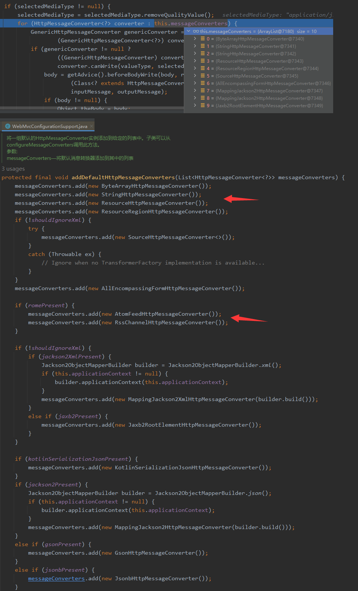

[TOC]

# 1.SpringBoot概览

## 1.1 Spring 的能力

1. 微服务(Microservices)
2. 响应式开发
3. 分布式开发(Spring Cloud)
4. Web开发(Spring MVC)
5. Serverless (无服务开发/函数式服务)
6. 事件驱动，结合分布式系统

> 为什么用SpringBoot—
> 能快速创建出生产级别的Spring应用

1. Create stand-alone Spring applications
   创建独立Spring应用
2. Embed Tomcat, Jetty or Undertow directly (no need to deploy WAR files)
   内嵌web服务器
3. Provide opinionated ‘starter’ dependencies to simplify your build configuration
   自动starter依赖，简化构建配置
4. Automatically configure Spring and 3rd party libraries whenever possible
   自动配置Spring以及第三方功能
5. Provide production-ready features such as metrics, health checks, and externalized configuration
   提供生产级别的监控、健康检查及外部化配置
6. Absolutely no code generation and no requirement for XML configuration
   无代码生成、无需编写XML
7. SpringBoot是整合Spring技术栈的一站式框架
8. SpringBoot是简化Spring技术栈的快速开发脚手架

## 1.2 SpringBoot应用入口

```
* SpringBoot Web应用入口启动类,引导加载自动配置类
@SpringBootApplication()
public class MainApplication {

    public static void main(String[] args) {

    }
}
```

`@SpringBootApplication 注解阐释`

```
@Target(ElementType.TYPE)
@Retention(RetentionPolicy.RUNTIME)
@Documented
@Inherited
@SpringBootConfiguration
@EnableAutoConfiguration
@ComponentScan(excludeFilters = { @Filter(type = FilterType.CUSTOM, classes = TypeExcludeFilter.class),
@Filter(type = FilterType.CUSTOM, classes = AutoConfigurationExcludeFilter.class) })
public @interface SpringBootApplication {

}

@Target(ElementType.TYPE)
@Retention(RetentionPolicy.RUNTIME)
@Documented
@Inherited
@AutoConfigurationPackage
@Import(AutoConfigurationImportSelector.class)
public @interface EnableAutoConfiguration {

}
```

* @SpringBootApplication 配置类，自动配置如何生效
  - @ComponentScan(excludeFilters = { @Filter(type = FilterType.CUSTOM, classes = TypeExcludeFilter.class),
  - @Filter(type = FilterType.CUSTOM, classes = AutoConfigurationExcludeFilter.class) })  包扫描注解，自定义扫描器
  - @EnableAutoConfiguration 开启自动配置
    - @AutoConfigurationPackage 自动配置包
    - @Import(AutoConfigurationPackages.Registrar.class) Registrar给容器中 某个包下的组件批量注册（MainApplication）
    - @Import(AutoConfigurationImportSelector.class)

      1. 利用getAutoConfigurationEntry(annotationMetadata);给容器中批量导入一些组件
      2. 调用List<String> configurations = AutoConfigurationImportSelector.getCandidateConfigurations(annotationMetadata, attributes)获取到所有需要导入到容器中的配置类
      3. 利用工厂加载 Map<String, List<String>> SpringFactoriesLoader.loadFactoryNames() 得到所有的组件
      4. classLoader.getResources(FACTORIES_RESOURCE_LOCATION)  从META-INF/spring.factories位置来加载所有配置文件
         - 默认扫描我们当前系统里面所有META-INF/spring.factories位置的文件
         - spring-boot-autoconfigure-2.3.4.RELEASE.jar包里面也有META-INF/spring.factories

      > org\springframework\boot\spring-boot\2.7.1\spring-boot-2.7.1.jar!\META-INF\spring.factories
      > org\springframework\boot\spring-boot-autoconfigure\2.7.1\spring-boot-autoconfigure-2.7.1.jar!\META-INF\spring.factories
      >

      `spring.factories文件里面配置了spring-boot启动时就要给容器中加载的所有配置类,但是最终会按照条件装配规则按需配置 xxxxAutoConfiguration(如BatchAutoConfiguration、CacheAutoConfiguration) @Conditional  @ConditionalOnClass(LocalContainerEntityManagerFactoryBean.class， @ConditionalOnBean(AbstractEntityManagerFactoryBean.class`

      ```java
      @AutoConfiguration
      //当项目引入了RabbitMq消息队列组件该配置类才会生效
      @ConditionalOnClass({ RabbitTemplate.class, Channel.class }) 
      @EnableConfigurationProperties(RabbitProperties.class)
      @Import({ RabbitAnnotationDrivenConfiguration.class, RabbitStreamConfiguration.class })
      public class RabbitAutoConfiguration {

      }
      ```

## 1.3 自动配置的条件装配规则

> org.springframework.boot.autoconfigure.web.servlet.DispatcherServletAutoConfiguration
> Web-Servlet 自动配置类，Spring-MVC 请求分发相关配置`

```java
@AutoConfigureOrder(Ordered.HIGHEST_PRECEDENCE) //装配最高优先级
//指定装配优先级在 ServletWebServerFactoryAutoConfiguration.class之后
@AutoConfiguration(after = ServletWebServerFactoryAutoConfiguration.class) 
@ConditionalOnWebApplication(type = Type.SERVLET)
@ConditionalOnClass(DispatcherServlet.class)
public class DispatcherServletAutoConfiguration {

    @ConditionalOnClass(ServletRegistrion.class)//当容器中有该组件时装配(tomcat包中已包含)
    @EnableConfigurationProperties(WebMvcPropeies.class)//开启该配置类绑定该配置文件功能 spring.mvc
    protected static class DispatcherServletConfiguration {

        @Bean
        @ConditionalOnBean(Multipartolver.class)
        @ConditionalOnMissingBean(name = DispatcherServlet.MULTIPART_RESOLVER_BEAN_NAME) 如果用户没有配置该组件，则将该bean 注册到容器中
        public MultipartResolver multipartResolver(MultipartResolver resolver) {
            // Detect if the user has created a MultipartResolver but named it incorrectly
            return resolver;
        }
    }
}
  
//配置属性前缀为 spring.mvc
@ConfigurationProperties(prefix = "spring.mvc")
public class WebMvcProperties {}
```

> org.springframework.boot.autoconfigure.aop.AopAutoConfiguration
> Aop自动配置类

```java
@AutoConfiguration
//当配置文件中配置了spring.aop.name，并且配置值为true时该装配生效。当未配置时，该值也为true
@ConditionalOnProperty(prefix = "spring.aop", name = "auto", havingValue = "true", matchIfMissing = true)
public class AopAutoConfiguration {

    @Configuration(proxyBeanMethods = false)
    @ConditionalOnClass(Advice.class) //当容器中存在该类时生效
    static class AspectJAutoProxyingConfiguration {

        @Configuration(proxyBeanMethods = false)
        @EnableAspectJAutoProxy(proxyTargetClass = false)
        @ConditionalOnProperty(prefix = "spring.aop", name = "proxy-target-class", havingValue = "false")
        static class JdkDynamicAutoProxyConfiguration { }

        @Configuration(proxyBeanMethods = false)
        @EnableAspectJAutoProxy(proxyTargetClass = true)
        @ConditionalOnProperty(prefix = "spring.aop", name = "proxy-target-class", havingValue = "true",
                matchIfMissing = true)
        static class CglibAutoProxyConfiguration { }
    }

    @Configuration(proxyBeanMethods = false)
    @ConditionalOnMissingClass("org.aspectj.weaver.Advice") //当容器中缺少Advice.class类时生效
    //当配置文件中配置了spring.aop.proxy-target-class，并且配置值为true时该装配生效。当未配置时，该值也为true
    @ConditionalOnProperty(prefix = "spring.aop", name = "proxy-target-class", havingValue = "true",
            matchIfMissing = true) 
    static class ClassProxyingConfiguration {

        //配置简单的Aop功能
        @Bean
        static BeanFactoryPostProcessor forceAutoProxyCreatorToUseClassProxying() {
            return (beanFactory) -> {
                if (beanFactory instanceof BeanDefinitionRegistry) {
                    BeanDefinitionRegistry registry = (BeanDefinitionRegistry) beanFactory;
                    AopConfigUtils.registerAutoProxyCreatorIfNecessary(registry);
                    AopConfigUtils.forceAutoProxyCreatorToUseClassProxying(registry);
                }
            };
        }

    }
}
```

> 总结：https://spring.io/projects/spring-boot

* SpringBoot先加载所有的自动配置类  xxxxxAutoConfiguration
  + org\springframework\boot\spring-boot\2.7.1\spring-boot-2.7.1.jar!\META-INF\spring.factories
  + org\springframework\boot\spring-boot-autoconfigure\2.7.1\spring-boot-autoconfigure-2.7.1.jar!\META-INF\spring.factories
* 每个自动配置类按照条件装配规则生效，默认都会绑定配置文件指定的值。xxxxProperties里面拿。xxxProperties和配置文件进行了绑定
* 生效的配置类就会给容器中装配很多组件
* 只要容器中有这些组件，相当于这些功能就有了
* 定制化配置
  + 用户直接自己@Bean替换底层的组件
  + 用户去看这个组件是获取的配置文件什么值就去修改。xxxxxAutoConfiguration ---> 组件  ---> xxxxProperties里面拿值  ----> application.properties 修改对应属性

## 1.4 注解的阐释

`注解可理解为释义说明，标记或标签，如类/属性/方法的说明。根据定义的不同，可在运行时或编译时被忽略或一直保存。`

`通常由反射获取该类上的注解信息，并以其作为初始配置信息做相应处理`

```java
@Retention(RetentionPolicy.RUNTIME)
public @interface CatAnnotations {

    int age() default 1;
    String name() default "";
}

@CatAnnotations(name = "cat class")//注解 修饰类
public class Cat {

    private String eatFood;
  
    @CatAnnotations(age = 10,name = "cat")//注解 修饰属性
    private String name;

    @CatAnnotations(name = "cat construtor")//注解 修饰构造器
    public Cat(String eatFood, String name) {
        this.eatFood = eatFood;
        this.name = name;
    }

    public String getEatFood() {
        return eatFood;
    }

    public void setEatFood(String eatFood) {
        this.eatFood = eatFood;
    }

    @CatAnnotations(name = "cat name")//注解 修饰方法
    public String getName() {
        return name;
    }

    public void setName(String name) {
        this.name = name;
    }
}

    public static void main(String[] args) throws NoSuchFieldException, NoSuchMethodException {

        //获取Cat class 实例
        Class<Cat> catClass = Cat.class;

        //反射获取 类上的注解
        TestAnnotations classAnnotation = catClass.getAnnotation(CatAnnotations.class);
        System.out.println("annotions:" + classAnnotation.age());
        System.out.println("annotions:" + classAnnotation.name());

        //反射获取 private属性上的注解
        Field name = catClass.getDeclaredField("name");
        CatAnnotations fieldAnnotation = name.getAnnotation(CatAnnotations.class);
        System.out.println("annotions-name:" + fieldAnnotation);
        //反射获取 方法上的注解
        Method me = catClass.getMethod("getName",null);
        CatAnnotations methodAnnotation = me.getAnnotation(CatAnnotations.class);

    }
```

> 总结：注解如何使用
[详见@RequestParam 注解分析](#3.4.2)

* 编译器可以利用注解来探测错误和检查信息，像@override检查是否重写
* 适合工具类型的软件用的，避免繁琐的代码，生成代码配置，比如jpa自动生成sql,日志注解，权限控制
* 程序运行时的处理： 某些注解可以在程序运行的时候，通过反射获取被代码所读取，因此我们可以自定义注解做一些初始配置为代码逻辑做支持

# 2.SpringMVC

## 2.1 SpringMVC概述

> Spring Boot provides auto-configuration for Spring MVC that works well with most applications.(大多场景我们都无需自定义配置)
> The auto-configuration adds the following features on top of Spring’s defaults: (自动配置在 Spring 的默认值之上添加了以下特性：)

* ● Inclusion of ContentNegotiatingViewResolver and BeanNameViewResolver beans.
* ○ 内容协商视图解析器和BeanName视图解析器
* ● Support for serving static resources, including support for WebJars (covered later in this document)).
* ○ 静态资源（包括webjars）
* ● Automatic registration of Converter, GenericConverter, and Formatter beans.
* ○ 自动注册 Converter，GenericConverter，Formatter
* ● Support for HttpMessageConverters (covered later in this document).
* ○ 支持 HttpMessageConverters （后来我们配合内容协商理解原理）
* ● Automatic registration of MessageCodesResolver (covered later in this document).
* ○ 自动注册 MessageCodesResolver （国际化用）
* ● Static index.html support.
* ○ 静态index.html 页支持
* ● Custom Favicon support (covered later in this document).
* ○ 自定义 Favicon
* ● Automatic use of a ConfigurableWebBindingInitializer bean (covered later in this document).
* ○ 自动使用 ConfigurableWebBindingInitializer ，（DataBinder负责将请求数据绑定到JavaBean上）

1. If you want to keep those Spring Boot MVC customizations and make more MVC customizations (interceptors, formatters,view controllers, and other features), you can add your own @Configuration class of type WebMvcConfigurer but without @EnableWebMvc.
   不用@EnableWebMvc注解。使用 @Configuration + WebMvcConfigurer 自定义规则
2. If you want to provide custom instances of RequestMappingHandlerMapping, RequestMappingHandlerAdapter, or ExceptionHandlerExceptionResolver,and still keep the Spring Boot MVC customizations, you can declare a bean of type WebMvcRegistrations and use it to provide custom instances of those components.
   声明 WebMvcRegistrations 改变默认底层组件
3. If you want to take complete control of Spring MVC, you can add your own @Configuration annotated with @EnableWebMvc,or alternatively add your own @Configuration-annotated DelegatingWebMvcConfiguration as described in the Javadoc of @EnableWebMvc.
   使用 @EnableWebMvc+@Configuration+DelegatingWebMvcConfiguration 全面接管SpringMVC

## 2.2.静态资源访问

> [classpath [META-INF/resources/], classpath [resources/], classpath [static/], classpath [public/], ServletContext [/]]
> 2022-08-04 16:07:22.954 DEBUG 25196 --- [nio-8080-exec-1] o.s.web.servlet.DispatcherServlet        : Completed 200 OK

只要静态资源放在资源路径下： resources/static (or /public or /resources or /META-INF/resources)
访问: 当前项目根路径/ + 静态资源名

原理: 静态映射/**

`spring.mvc.static-path-pattern 属性资源映射调整`

`spring.web.resources.static-locations 属性自定义静态资源位置`

请求进来，DispatcherServlet 分发处理，先去找Controller看能不能处理。不能处理的所有请求又都交给静态资源处理器。静态资源也找不到则响应404页面

欢迎页支持

`静态资源路径下  index.html`

网站图标支持
`'favicon.ico 放在静态资源目录下即可`

## 2.3 静态资源配置原理(WebMvcAutoConfiguration)

* org.springframework.boot.autoconfigure.web.servlet.WebMvcAutoConfiguration
* SpringBoot启动默认加载  xxxAutoConfiguration 类（自动配置类）

```java
@ConditionalOnWebApplication(type = Type.SERVLET)
@ConditionalOnClass({ Servlet.class, DispatcherServlet.class, WebMvcConfigurer.class })
@ConditionalOnMissingBean(WebMvcConfigurationSupport.class) //当容器中缺少 WebMvcConfigurationSupport 组件时生效，该组件用于自定义MVC配置
@AutoConfigureOrder(Ordered.HIGHEST_PRECEDENCE + 10)
@AutoConfigureAfter({ DispatcherServletAutoConfiguration.class, TaskExecutionAutoConfiguration.class,
ValidationAutoConfiguration.class })
public class WebMvcAutoConfiguration {}
```

* 给容器中配了什么

```java
@Configuration(proxyBeanMethods = false)
@Import(EnableWebMvcConfiguration.class)
@EnableConfigurationProperties({ WebMvcProperties.class, ResourceProperties.class }) //配置属性
@Order(0)
public static class WebMvcAutoConfigurationAdapter implements WebMvcConfigurer {}
```

* 配置文件的相关属性和xxx进行了绑定

`WebMvcProperties==spring.mvc    WebProperties==spring.web`

```java
//配置类只有一个有参构造器，有参构造器所有参数的值都会从容器中确定
//WebProperties webProperties；获取和spring.web绑定的所有的值的对象
//WebMvcProperties mvcProperties 获取和spring.mvc绑定的所有的值的对象
//ListableBeanFactory beanFactory Spring的beanFactory
//HttpMessageConverters 找到所有的HttpMessageConverters  Http请求和响应处理
//ResourceHandlerRegistrationCustomizer 找到 资源处理器的自定义器。=========
//DispatcherServletPath  处理分发器
//ServletRegistrationBean   给应用注册Servlet、Filter....
public WebMvcAutoConfigurationAdapter(WebProperties webProperties, WebMvcProperties mvcProperties,
                  ListableBeanFactory beanFactory, ObjectProvider<HttpMessageConverters> messageConvertersProvider,
                  ObjectProvider<ResourceHandlerRegistrationCustomizer> resourceHandlerRegistrationCustomizerProvider,
                  ObjectProvider<DispatcherServletPath> dispatcherServletPath,
                  ObjectProvider<ServletRegistrationBean<?>> servletRegistrations) {
    this.resourceProperties = resourceProperties;
    this.mvcProperties = mvcProperties;
    this.beanFactory = beanFactory;
    this.messageConvertersProvider = messageConvertersProvider;
    this.resourceHandlerRegistrationCustomizer = resourceHandlerRegistrationCustomizerProvider.getIfAvailable();
    this.dispatcherServletPath = dispatcherServletPath;
    this.servletRegistrations = servletRegistrations;
}
```

```java
//资源处理的默认规则
//CLASSPATH_RESOURCE_LOCATIONS = { "classpath:/META-INF/resources/", "classpath:/resources/", "classpath:/static/", "classpath:/public/" }
public void addResourceHandlers(ResourceHandlerRegistry registry) {
    if (!this.resourceProperties.isAddMappings()) {
        logger.debug("Default resource handling disabled");
        return;
    }
    //webjars的规则
    addResourceHandler(registry, "/webjars/**", "classpath:/META-INF/resources/webjars/");
    addResourceHandler(registry, this.mvcProperties.getStaticPathPattern(), (registration) -> {
        registration.addResourceLocations(this.resourceProperties.getStaticLocations());
        if (this.servletContext != null) {
            ServletContextResource resource = new ServletContextResource(this.servletContext, SERVLET_LOCATION);
            registration.addResourceLocations(resource);
        }
    });
}
```

```java
//HandlerMapping：定义请求和处理响应对象之间的映射处理器。保存了每一个Handler能处理哪些请求。
//WelcomePageHandlerMapping 欢迎页响应处理(/index.hteml)
@Bean
public WelcomePageHandlerMapping welcomePageHandlerMapping(ApplicationContext applicationContext,
                                                           FormattingConversionService mvcConversionService, ResourceUrlProvider mvcResourceUrlProvider) {
    WelcomePageHandlerMapping welcomePageHandlerMapping = new WelcomePageHandlerMapping(
            new TemplateAvailabilityProviders(applicationContext), applicationContext, getWelcomePage(),
            this.mvcProperties.getStaticPathPattern());
    welcomePageHandlerMapping.setInterceptors(getInterceptors(mvcConversionService, mvcResourceUrlProvider));
    welcomePageHandlerMapping.setCorsConfigurations(getCorsConfigurations());
    return welcomePageHandlerMapping;
}

WelcomePageHandlerMapping(TemplateAvailabilityProviders templateAvailabilityProviders,
                          ApplicationContext applicationContext, org.springframework.core.io.Resource welcomePage, String staticPathPattern) {
    if (welcomePage != null && "/**".equals(staticPathPattern)) {
        logger.info("Adding welcome page: " + welcomePage);
        setRootViewName("forward:index.html");
    }
    else if (welcomeTemplateExists(templateAvailabilityProviders, applicationContext)) {
        logger.info("Adding welcome page template: index");
        setRootViewName("index");
    }
}
```

# 3.请求参数处理(Rest)

## 3.1 WebMvcAutoConfiguration-HiddenHttpMethodFilter-隐藏http方法过滤器

> org.springframework.boot.autoconfigure.web.servlet.WebMvcAutoConfiguration

* @xxxMapping
* Rest风格支持（使用HTTP请求方式动词来表示对资源的操作）
  ○ 以前：/getUser   获取用户     /deleteUser 删除用户    /editUser  修改用户       /saveUser 保存用户
  ○ 现在： /user    GET-获取用户    DELETE-删除用户     PUT-修改用户      POST-保存用户
  ○ 核心Filter HiddenHttpMethodFilter

`手动配置开启-spring.mvc.hiddenmethod.filter.enabled=true`

* 用法: 表单method=put, 隐藏域 _method=put

```java
//WebMvcAutoConfiguration中配置
@Bean
@ConditionalOnMissingBean(HiddenHttpMethodFilter.class)
@ConditionalOnProperty(prefix = "spring.mvc.hiddenmethod.filter", name = "enabled")
public OrderedHiddenHttpMethodFilter hiddenHttpMethodFilter() {
    return new OrderedHiddenHttpMethodFilter();
}

//http方法过滤器
public class HiddenHttpMethodFilter extends OncePerRequestFilter {

    private static final List<String> ALLOWED_METHODS =
            Collections.unmodifiableList(Arrays.asList(HttpMethod.PUT.name(),
                    HttpMethod.DELETE.name(), HttpMethod.PATCH.name()));

    /** Default method parameter: {@code _method}. */
    public static final String DEFAULT_METHOD_PARAM = "_method";

    private String methodParam = DEFAULT_METHOD_PARAM;

    //方法过滤
    @Override
    protected void doFilterInternal(HttpServletRequest request, HttpServletResponse response, FilterChain filterChain)
            throws ServletException, IOException {
        HttpServletRequest requestToUse = request;
        if ("POST".equals(request.getMethod()) && request.getAttribute(WebUtils.ERROR_EXCEPTION_ATTRIBUTE) == null) {
            String paramValue = request.getParameter(this.methodParam);
            if (StringUtils.hasLength(paramValue)) {
                String method = paramValue.toUpperCase(Locale.ENGLISH);
                if (ALLOWED_METHODS.contains(method)) {
                    requestToUse = new HttpMethodRequestWrapper(request, method);
                }
            }
        }
        filterChain.doFilter(requestToUse, response);
    }
}
```

## 3.2 Rest原理（from表单提交要使用REST的时候）(ServletRequestWrapper)

* 主流浏览器from表单请求时，只支持get/post请求，不支持rest风格请求
* 欲支持rest风格请求时，在表单提交中带上带上参数_method，指定rest请求方式(PUT/DELETE)
* 请求过来被HiddenHttpMethodFilter拦截
* 请求是否正常，并且请求方式是POST
* 获取到表单中_method的值
* 兼容以下请求: PUT.DELETE.PATCH
* 原生的使用了post请求的request，通过包装模式requestWrapper重写了getMethod方法，传递_method参数，getMethod方法返回的是新rest请求方式
* 过滤器链放行的时候用wrapper，调用getMethod方法识别当前请求方式则会调用requestWrapper的，返回传入的_method参数
* 从而匹配到对应的rest 请求处理方法

> Rest使用客户端工具/api请求(如安卓请求)，如PostMan直接发送put、delete等方式请求，无需Filter。因为request请求可指定rest请求方式

```java
public class WebMvcAutoConfiguration {
    ...
    //配置表单支持rest提交 _method参数是否隐藏，默认false
    @Bean
    @ConditionalOnMissingBean(HiddenHttpMethodFilter.class)
    @ConditionalOnProperty(prefix = "spring.mvc.hiddenmethod.filter", name = "enabled")
    public OrderedHiddenHttpMethodFilter hiddenHttpMethodFilter() {
        return new OrderedHiddenHttpMethodFilter();
    }
}

public class HiddenHttpMethodFilter extends OncePerRequestFilter {

    private static final List<String> ALLOWED_METHODS =
            Collections.unmodifiableList(Arrays.asList(HttpMethod.PUT.name(),
                    HttpMethod.DELETE.name(), HttpMethod.PATCH.name()));

    /** 
     * Default method parameter: {@code _method}. 
     **/
    public static final String DEFAULT_METHOD_PARAM = "_method";

    private String methodParam = DEFAULT_METHOD_PARAM;
  
    //当配置生效时
    ...
    @Override
    protected void doFilterInternal(HttpServletRequest request, HttpServletResponse response, FilterChain filterChain)
            throws ServletException, IOException {

        HttpServletRequest requestToUse = request;
        //请求方式是post 并且没有错误
        if ("POST".equals(request.getMethod()) && request.getAttribute(WebUtils.ERROR_EXCEPTION_ATTRIBUTE) == null) {
            //获取请求参数中是否有 _method
            String paramValue = request.getParameter(this.methodParam);
            if (StringUtils.hasLength(paramValue)) {
                //忽略大小写
                String method = paramValue.toUpperCase(Locale.ENGLISH);
                //参数值在请求范围内
                if (ALLOWED_METHODS.contains(method)) {
                    //通过包装模式requestWrapper重写了getMethod方法返回新的request
                    requestToUse = new HttpMethodRequestWrapper(request, method);
                }
            }
        }
        //过滤器将新request请求发行处理
        filterChain.doFilter(requestToUse, response);
    }

  
    private static class HttpMethodRequestWrapper extends HttpServletRequestWrapper {

        private final String method;

        public HttpMethodRequestWrapper(HttpServletRequest request, String method) {
            super(request);
            this.method = method;
        }

        //重写getMethod方法返回传入的 _method rest新请求方式
        @Override
        public String getMethod() {
            return this.method;
        }
    }
}
```

```html
<form action="/user" method="get">
    <input value="REST-GET提交" type="submit" />
</form>

<form action="/user" method="post">
    <input value="REST-POST提交" type="submit" />
</form>

<form action="/user" method="post">
    <input name="_method" type="hidden" value="DELETE"/>
    <input value="REST-DELETE 提交" type="submit"/>
</form>

<form action="/user" method="post">
    <input name="_method" type="hidden" value="PUT" />
    <input value="REST-PUT提交"type="submit" />
<form>
```

## 3.3请求映射原理(DispatcherServlet)

> SpringMvc中的DispatcherServlet是负责处理所有请求的开始

DispatcherServlet 类继承关系
`DispatcherServlet->FrameworkServlet->HttpServletBean->HttpServlet`

`org.springframework.web.servlet.HttpServletBean`

`javax.servlet.http.HttpServlet`

`关注HttpServlet 核心的 doGet(),doPost()方法`

> Http请求方法分发逻辑

`HttpServlet.doGet()->FrameworkServlet.doGet()->FrameworkServlet.processRequest()->DispatcherServlet.doService()->DispatcherServlet.doDispatch()`

> DispatcherServlet.doDispatch() 方法是SpringMvc 中每个请求都会首先经过的方法，由该方法决定请求分派匹配规则

```java
protected void doDispatch(HttpServletRequest request, HttpServletResponse response) throws Exception{
  HttpServletRequest processedRequest=request;
  HandlerExecutionChain mappedHandler=null;
  boolean multipartRequestParsed=false;

  WebAsyncManager asyncManager=WebAsyncUtils.getAsyncManager(request);
  //检测是否是文件请求
  processedRequest = checkMultipart(request);
  multipartRequestParsed = (processedRequest != request);

  // Determine handler for the current request. 决定当前请求由哪个handler(Controller) 处理
  mappedHandler = getHandler(processedRequest);
  // HandlerMapping 处理器映射
  if (mappedHandler == null) {
     noHandlerFound(processedRequest, response);
     return;
  }
  ...
  
  
}
```

> 分发请求路径地址映射匹配逻辑

`DispatcherServlet.doDispatch()->DispatcherServlet.getHandler()-> HandlerMapping.getHandler()->HandlerMapping.getHandlerInternal()->HandlerMapping.lookupHandlerMethod()->MappingRegistry.getMappingsByDirectPath()->MappingRegistry.addMatchingMappings()`

```java
protected HandlerExecutionChain getHandler(HttpServletRequest request) throws Exception {
    if (this.handlerMappings != null) {
        for (HandlerMapping mapping : this.handlerMappings) {
            HandlerExecutionChain handler = mapping.getHandler(request);
            if (handler != null) {
                return handler;
            }
        }
    }
    return null;
}

    0 = {RequestMappingHandlerMapping@7139} //保存了所有RequestMapping(GetMapping/PostMapping)和HandlerMapping的映射规则
    1 = {WelcomePageHandlerMapping@7140}
    2 = {BeanNameUrlHandlerMapping@7141}
    3 = {RouterFunctionMapping@7142}
    4 = {SimpleUrlHandlerMapping@7143}

protected HandlerMethod getHandlerInternal(HttpServletRequest request) throws Exception {
    //获取请求访问路径
    String lookupPath = initLookupPath(request);
    //获取映射list读取锁
    this.mappingRegistry.acquireReadLock();
    try {
        //寻找请求路径是否有匹配值
        HandlerMethod handlerMethod = lookupHandlerMethod(lookupPath, request);
        return (handlerMethod != null ? handlerMethod.createWithResolvedBean() : null);
    }
    finally {
        this.mappingRegistry.releaseReadLock();
    }
}

protected HandlerMethod lookupHandlerMethod(String lookupPath, HttpServletRequest request) throws Exception{
    List<Match> matches=new ArrayList<>();
    //匹配当前请求路径的值
    List<T> directPathMatches=this.mappingRegistry.getMappingsByDirectPath(lookupPath);
    //匹配到/user路径请求的所有RequestMapping
    directPathMatches = {ArrayList@7475}  size = 4
        0 = {RequestMappingInfo@7456} "{PUT [/user]}"
        1 = {RequestMappingInfo@7454} "{POST [/user]}"
        2 = {RequestMappingInfo@7462} "{GET [/user]}"
        3 = {RequestMappingInfo@7458} "{DELETE [/user]}"
  
    if(directPathMatches!=null){
        //将所有匹配到的结果加入缓存集合中
        addMatchingMappings(directPathMatches,matches,request);
    }
    if(matches.isEmpty()){
        addMatchingMappings(this.mappingRegistry.getRegistrations().keySet(),matches,request);
    }
    if (!matches.isEmpty()){
        Match bestMatch=matches.get(0);
        //匹配结果有多个，则需要再次匹配
        if(matches.size()>1){
            Comparator<Match> comparator=new MatchComparator(getMappingComparator(request));
            matches.sort(comparator);
        }
        ...
    }
    ...
}
```


<details>
  <summary>WebMvcConfigurationSupport</summary>

```java
//SpringBoot 容器中自动创建的RequestMappingHandlerMapping，用于解析所有 @RequestMapping 注解的方法
public class WebMvcConfigurationSupport implements ApplicationContextAware, ServletContextAware {
    ...
    /**
     * Return a {@link RequestMappingHandlerMapping} ordered at 0 for mapping
     * requests to annotated controllers.
     * 返回一个顺序为0的RequestMappingHandlerMapping，用于将请求映射到带注释的控制器
     */
    @Bean
    @SuppressWarnings("deprecation")
    public RequestMappingHandlerMapping requestMappingHandlerMapping(
            @Qualifier("mvcContentNegotiationManager") ContentNegotiationManager contentNegotiationManager,
            @Qualifier("mvcConversionService") FormattingConversionService conversionService,
            @Qualifier("mvcResourceUrlProvider") ResourceUrlProvider resourceUrlProvider) {

        RequestMappingHandlerMapping mapping = createRequestMappingHandlerMapping();
        mapping.setOrder(0);
        mapping.setInterceptors(getInterceptors(conversionService, resourceUrlProvider));
        mapping.setContentNegotiationManager(contentNegotiationManager);
        mapping.setCorsConfigurations(getCorsConfigurations());
        ...
    }
    ...
}
```
</details>
HandlerMappings(List)-所有的请求映射都存放在此

* RequestMappingHandlerMapping -保存了所有@RequestMapping 和handler(Controller)的映射规则(MappingRegistry-映射注册中心)
* WelcomePageHandlerMapping -SpringBoot自动配置欢迎页, 访问 /能访问到index.html
* BeanNameUrlHandlerMapping
* RouterFunctionMapping
* SimpleUrlHandlerMapping

1. SpringBoot自动配置欢迎页的 WelcomePageHandlerMapping 。访问/ 能访问到index.html；
2. SpringBoot自动配置了默认的 RequestMappingHandlerMapping
3. 请求进来，挨个尝试所有的HandlerMapping看是否有请求信息
   * 如果有就找到这个请求对应的handler
   * 如果没有就是下一个 HandlerMapping
4. 我们需要一些自定义的映射处理，我们也可以自己给容器中自定义HandlerMapping

## 3.4 SpringMvc常用处理web请求注解

### 3.4.1 web请求传参使用注解

* @PathVariable 获取url路径变量上的参数，也可通过Map<String,String>取值
* @RequestHeader 获取请求头内容，可单独获取某个参数或通过Map<String,String>取值
* @RequestParam 获取请求参数
* @CookieValue 获取某个Cookie的值(_ga)，或通过Cookie类型获取
* @RequestBody 获取post请求的请求体信息
* @RequestAttribute 获取request域中属性，通过用于页面转发时保存数据(注:请求方法上需加上 @ResponseBody注解)
* @MatrixVariable
  * /cars/{path}?xxx=xxx&a=cc  queryString 查询字符串 @RequestParam
  * /cars/sell;low=34;brand=byd,audi,yd
  * /cars/sell;low=34;brand=byd;brand=audi;brand=yd  使用矩阵变量重写url路径
  * 矩阵变量需要在springBoot中手动开启
  * 根据RFC3986的规范，矩阵变量应当绑定在路径变量中
  * 若是有多个矩阵变量，应当使用英文符号;进行分隔
  * 若是一个矩阵变量有多个值，应当使用英文符号,进行分隔，或之命名多个重复的key即可
* @ModelAttribute

<details>
  <summary>代码示例</summary>

```java
    @RequestMapping("/hello")
    public String hello(@RequestParam("username") String name){
        return "hello:" + name;
    }

    @RequestMapping("/hello")
    public String hello(@RequestParam String name){
        return "hello:" + name;
    }

    // car/2/owner/zhangsan @PathVariable 获取url路径变量上的参数，参数也可存放在Map<String,String>中
    @GetMapping("/getCar/{id}/owner/{username}")
    public Map<String,Object> getCar(@PathVariable("id") Integer carId,
                                     @PathVariable("username") String name,
                                     @PathVariable Map<String,String> pv,
                                     @RequestHeader("host") String headerHost,
                                     @RequestHeader("Referer") String headerOrigin,
                                     @RequestHeader Map<String,String> headerMap,
                                     @RequestParam("id") Integer id,
                                     @RequestParam("ints") List<String> paramList,
                                     @RequestParam Map<String,String> paramMap,
                                     @CookieValue("_ga") String _ga,
                                     @CookieValue("_ga") Cookie cookie){
        Map<String,Object> map = new HashMap<>();
        map.put("car1", "新车1-" + carId + "|车主-" + name);
        map.put("car1-copy", "新车1copy-" + pv.get("id") + "|车主-" + pv.get("username"));
        map.put("header", headerMap);
        map.put("param",paramMap);
        map.put("cookie", _ga);
        map.put("cookie2", cookie.getName() + ":" + cookie.getValue());
        return map;
    }

    @PostMapping("/postCar/{id}/owner/{username}")
    public Map<String,Object> postCar(@PathVariable("id") Integer carId,
                                      @PathVariable("username") String name,
                                      @PathVariable Map<String,String> pv,
                                      @RequestParam("userName") Integer userName,
                                      @RequestParam("email") List<String> email,
                                      @RequestBody String requestBody){
        Map<String,Object> map = new HashMap<>();
        map.put("car1", "新车1-" + carId + "|车主-" + name);
        map.put("car1-copy", "新车1copy-" + pv.get("id") + "|车主-" + pv.get("username"));
        map.put("body", requestBody);
        //@RequestAttribute String requestAttribute
        //map.put("attribute", requestAttribute);
        return map;
    }

@Controller
//@RestController
public class GotoController {

    private Enumeration<String> attributeNames;

    @GetMapping("/goto")
    public String gotoCar(HttpServletRequest request){
        //设置请求域request属性
        request.setAttribute("msg","success...");
        request.setAttribute("code","0");
        //转发到 gotoSuccess请求
        return "forward:/gotoSuccess";
    }
    @ResponseBody
    @GetMapping("/gotoSuccess")
    public Map<String,Object> successCar(@RequestAttribute("msg") String msg,
                                         HttpServletRequest request){
        Map<String,Object> map = new HashMap<>();
        //请求属性，获取request域中属性，通过用于页面转发时保存数据
        map.put("msg", msg);
        map.put("code", request.getAttribute("code"));
        return map;
    }
}

    @Bean
    public WebMvcConfigurer webMvcConfigurer(){
        WebMvcConfigurer webMvcConfigurer = new WebMvcConfigurer() {
            @Override
            public void configurePathMatch(PathMatchConfigurer configurer) {
                UrlPathHelper urlPathHelper = new UrlPathHelper();
                //设置不移除 ;后面的内容，使矩阵变量注解可用
                urlPathHelper.setAlwaysUseFullPath(false);
                configurer.setUrlPathHelper(urlPathHelper);
            }
        };
        return webMvcConfigurer;
    }
  
    // /cars/sell;low=34;brand=byd,audi,yd
    //SpringBoot 默认禁用了矩阵变量注解功能
    // 手动开启: SpringBoot mvc配置中对于url请求路径的处理，UrlPathHelper进行解析
    // removeSemicolonContent 配置对于url路径中 ; 分号后内容移除，故矩阵变量注解不生效
    // 矩阵变量必须用url 路径变量才能生效
    @GetMapping("/matrixCar/{path}")
    public Map<String,Object> matrixCar(@MatrixVariable("low") Integer low,
                                        @MatrixVariable("brand") List<String> brands,
                                        @PathVariable("path") String path){
        Map<String,Object> map = new HashMap<>();
        map.put("low", low);
        map.put("brand", brands);
        map.put("path", path);
        return map;
    }
```
</details>

### 3.4.2 请求响应源码分析 <a id="3.4.2"></a>

<details>
  <summary>DispatcherServlet</summary>

```java
public class DispatcherServlet extends FrameworkServlet {
    ...
    protected void doDispatch(HttpServletRequest request, HttpServletResponse response) throws Exception {
        HttpServletRequest processedRequest = request;
        HandlerExecutionChain mappedHandler = null;
        boolean multipartRequestParsed = false;

        WebAsyncManager asyncManager = WebAsyncUtils.getAsyncManager(request);

        try {
            ModelAndView mv = null;
            Exception dispatchException = null;

            try {
                //检测是否是文件请求
                processedRequest = checkMultipart(request);
                multipartRequestParsed = (processedRequest != request);

                // Determine handler for the current request. 决定当前请求由哪个handler(Controller) 处理
                mappedHandler = getHandler(processedRequest);
                // HandlerMapping 处理器映射
                if (mappedHandler == null) {
                    noHandlerFound(processedRequest, response);
                    return;
                }

                // Determine handler adapter for the current request. 确定当前请求的处理程序适配器。
                HandlerAdapter ha = getHandlerAdapter(mappedHandler.getHandler());

                // Process last-modified header, if supported by the handler. 如果处理程序支持，则处理最后修改的标头。
                String method = request.getMethod();
                boolean isGet = HttpMethod.GET.matches(method);
                if (isGet || HttpMethod.HEAD.matches(method)) {
                    long lastModified = ha.getLastModified(request, mappedHandler.getHandler());
                    if (new ServletWebRequest(request, response).checkNotModified(lastModified) && isGet) {
                        return;
                    }
                }


                if (!mappedHandler.applyPreHandle(processedRequest, response)) {
                    return;
                }

                // Actually invoke the handler. 真正的handler调用处理程序(RequestMappingHandlerAdapter)
                mv = ha.handle(processedRequest, response, mappedHandler.getHandler());

                if (asyncManager.isConcurrentHandlingStarted()) {
                  return;
                }
  
                applyDefaultViewName(processedRequest, mv);
                //应用注册拦截器的postHandle方法。
                mappedHandler.applyPostHandle(processedRequest, response, mv);
            }
            //处理 处理程序选择和处理程序调用的结果，它要么是ModelAndView，要么是要解析为ModelAndView的异常。
            processDispatchResult(processedRequest, response, mappedHandler, mv, dispatchException);
        }
    }

  private void processDispatchResult(HttpServletRequest request, HttpServletResponse response,
                                     @Nullable HandlerExecutionChain mappedHandler, @Nullable ModelAndView mv,
                                     @Nullable Exception exception) throws Exception {
    boolean errorView = false;

    if (exception != null) {
      if (exception instanceof ModelAndViewDefiningException) {
        logger.debug("ModelAndViewDefiningException encountered", exception);
        mv = ((ModelAndViewDefiningException) exception).getModelAndView();
      }
      else {
        Object handler = (mappedHandler != null ? mappedHandler.getHandler() : null);
        mv = processHandlerException(request, response, handler, exception);
        errorView = (mv != null);
      }
    }

    // Did the handler return a view to render? 处理程序是否返回要渲染的视图?
    //img10
    if (mv != null && !mv.wasCleared()) {
      //渲染View。呈现给定的ModelAndView。 这是处理请求的最后一个阶段。它可能涉及按名称解析视图。
      render(mv, request, response);
      if (errorView) {
        WebUtils.clearErrorRequestAttributes(request);
      }
    }
    else {
      if (logger.isTraceEnabled()) {
        logger.trace("No view rendering, null ModelAndView returned.");
      }
    }

    if (WebAsyncUtils.getAsyncManager(request).isConcurrentHandlingStarted()) {
      // Concurrent handling started during a forward
      return;
    }

    if (mappedHandler != null) {
      // Exception (if any) is already handled..
      mappedHandler.triggerAfterCompletion(request, response, null);
    }
  }

  /**
   * Render the given ModelAndView.
   * <p>This is the last stage in handling a request. It may involve resolving the view by name.
   * @param mv the ModelAndView to render
   * @param request current HTTP servlet request
   * @param response current HTTP servlet response
   * @throws ServletException if view is missing or cannot be resolved
   * @throws Exception if there's a problem rendering the view
   * 渲染给定的ModelAndView。 这是处理请求的最后一个阶段。它可能涉及按名称解析视图。
   */
  protected void render(ModelAndView mv, HttpServletRequest request, HttpServletResponse response) throws Exception {
    // Determine locale for request and apply it to the response.
    Locale locale =
            (this.localeResolver != null ? this.localeResolver.resolveLocale(request) : request.getLocale());
    response.setLocale(locale);

    View view;
    String viewName = mv.getViewName();
    if (viewName != null) {
      // We need to resolve the view name. 解析view name
      view = resolveViewName(viewName, mv.getModelInternal(), locale, request);
      if (view == null) {
        throw new ServletException("Could not resolve view with name '" + mv.getViewName() +
                "' in servlet with name '" + getServletName() + "'");
      }
    }
    else {
      // No need to lookup: the ModelAndView object contains the actual View object.
      view = mv.getView();
      if (view == null) {
        throw new ServletException("ModelAndView [" + mv + "] neither contains a view name nor a " +
                "View object in servlet with name '" + getServletName() + "'");
      }
    }

    // Delegate to the View object for rendering.
    if (logger.isTraceEnabled()) {
      logger.trace("Rendering view [" + view + "] ");
    }
    try {
      if (mv.getStatus() != null) {
        request.setAttribute(View.RESPONSE_STATUS_ATTRIBUTE, mv.getStatus());
        response.setStatus(mv.getStatus().value());
      }
      //视图执行渲染
      view.render(mv.getModelInternal(), request, response);
    }
    catch (Exception ex) {
      if (logger.isDebugEnabled()) {
        logger.debug("Error rendering view [" + view + "]", ex);
      }
      throw ex;
    }
  }

  /**
   * Resolve the given view name into a View object (to be rendered).
   * <p>The default implementations asks all ViewResolvers of this dispatcher.
   * Can be overridden for custom resolution strategies, potentially based on
   * specific model attributes or request parameters.
   * @param viewName the name of the view to resolve
   * @param model the model to be passed to the view
   * @param locale the current locale
   * @param request current HTTP servlet request
   * @return the View object, or {@code null} if none found
   * @throws Exception if the view cannot be resolved
   * (typically in case of problems creating an actual View object)
   * @see ViewResolver#resolveViewName
   * 
   * 将给定的视图名称解析为一个视图对象(要呈现)。 
   * 默认的实现询问这个调度程序的所有ViewResolvers。可以覆盖自定义解析策略，可能基于特定的模型属性或请求参数
   */
  @Nullable
  protected View resolveViewName(String viewName, @Nullable Map<String, Object> model,
                                 Locale locale, HttpServletRequest request) throws Exception {

    if (this.viewResolvers != null) {
      for (ViewResolver viewResolver : this.viewResolvers) {
          //视图解析器解析
        View view = viewResolver.resolveViewName(viewName, locale);
        if (view != null) {
          return view;
        }
      }
    }
    return null;
  }
  
}
```
</details>

<details>
  <summary>ContentNegotiatingViewResolver</summary>

```java
public class ContentNegotiatingViewResolver extends WebApplicationObjectSupport
        implements ViewResolver, Ordered, InitializingBean {
    ...
    @Override
    @Nullable
    public View resolveViewName(String viewName, Locale locale) throws Exception {
        //获取请求域属性
        RequestAttributes attrs = RequestContextHolder.getRequestAttributes();
        Assert.state(attrs instanceof ServletRequestAttributes, "No current ServletRequestAttributes");
        List<MediaType> requestedMediaTypes = getMediaTypes(((ServletRequestAttributes) attrs).getRequest());
        if (requestedMediaTypes != null) {
            List<View> candidateViews = getCandidateViews(viewName, locale, requestedMediaTypes);
            //获取视图
            View bestView = getBestView(candidateViews, requestedMediaTypes, attrs);
            if (bestView != null) {
                return bestView;
            }
        }
    
        String mediaTypeInfo = logger.isDebugEnabled() && requestedMediaTypes != null ?
                " given " + requestedMediaTypes.toString() : "";
    
        if (this.useNotAcceptableStatusCode) {
            if (logger.isDebugEnabled()) {
              logger.debug("Using 406 NOT_ACCEPTABLE" + mediaTypeInfo);
            }
            return NOT_ACCEPTABLE_VIEW;
        } else {
            logger.debug("View remains unresolved" + mediaTypeInfo);
            return null;
        }
    }
}
  
  
```
</details>

<details>
  <summary>AbstractView</summary>

```java
public abstract class AbstractView extends WebApplicationObjectSupport implements View, BeanNameAware {
  ...
    /**
   * Prepares the view given the specified model, merging it with static
   * attributes and a RequestContext attribute, if necessary.
   * Delegates to renderMergedOutputModel for the actual rendering.
   * @see #renderMergedOutputModel
   * 根据指定的模型准备视图，并将其与静态属性和RequestContext属性合并(如果需要的话)。委托renderMergedOutputModel进行实际渲染。
   */
  @Override
  public void render(@Nullable Map<String, ?> model, HttpServletRequest request,
                     HttpServletResponse response) throws Exception {
      if (logger.isDebugEnabled()) {
        logger.debug("View " + formatViewName() +
                ", model " + (model != null ? model : Collections.emptyMap()) +
                (this.staticAttributes.isEmpty() ? "" : ", static attributes " + this.staticAttributes));
      }
      //创建合并输出模型(合并model中的数据)
      Map<String, Object> mergedModel = createMergedOutputModel(model, request, response);
      prepareResponse(request, response);
      //合并输出模型
      renderMergedOutputModel(mergedModel, getRequestToExpose(request), response);
  }

  /**
   * Creates a combined output Map (never {@code null}) that includes dynamic values and static attributes.
   * Dynamic values take precedence over static attributes.
   * 创建包含动态值和静态属性的组合输出Map(从不为{@code null})。动态值优先于静态属性。
   */
  protected Map<String, Object> createMergedOutputModel(@Nullable Map<String, ?> model,
                                                        HttpServletRequest request, HttpServletResponse response) {
      @SuppressWarnings("unchecked")
      Map<String, Object> pathVars = (this.exposePathVariables ?
              (Map<String, Object>) request.getAttribute(View.PATH_VARIABLES) : null);
  
      // Consolidate static and dynamic model attributes.
      int size = this.staticAttributes.size();
      size += (model != null ? model.size() : 0);
      size += (pathVars != null ? pathVars.size() : 0);
  
      Map<String, Object> mergedModel = CollectionUtils.newLinkedHashMap(size);
      mergedModel.putAll(this.staticAttributes);
      if (pathVars != null) {
        mergedModel.putAll(pathVars);
      }
      if (model != null) {
          //将model中的数据合并
           mergedModel.putAll(model);
      }
  
      // Expose RequestContext?
      if (this.requestContextAttribute != null) {
        mergedModel.put(this.requestContextAttribute, createRequestContext(request, response, mergedModel));
      }
  
      return mergedModel;
  }

  /**
   * Render the internal resource given the specified model.
   * This includes setting the model as request attributes.
   * 根据指定的模型呈现内部资源。这包括将模型设置为请求属性。
   */
  @Override
  protected void renderMergedOutputModel(
          Map<String, Object> model, HttpServletRequest request, HttpServletResponse response) throws Exception {

      // Expose the model object as request attributes. 将模型对象公开为请求属性
      exposeModelAsRequestAttributes(model, request);
  
      // Expose helpers as request attributes, if any.
      exposeHelpers(request);
  
      // Determine the path for the request dispatcher.
      String dispatcherPath = prepareForRendering(request, response);
  
      // Obtain a RequestDispatcher for the target resource (typically a JSP).
      RequestDispatcher rd = getRequestDispatcher(request, dispatcherPath);
      if (rd == null) {
        throw new ServletException("Could not get RequestDispatcher for [" + getUrl() +
                "]: Check that the corresponding file exists within your web application archive!");
      }
  
      // If already included or response already committed, perform include, else forward.
      if (useInclude(request, response)) {
        response.setContentType(getContentType());
        if (logger.isDebugEnabled()) {
          logger.debug("Including [" + getUrl() + "]");
        }
        rd.include(request, response);
      }
  
      else {
        // Note: The forwarded resource is supposed to determine the content type itself.
        if (logger.isDebugEnabled()) {
          logger.debug("Forwarding to [" + getUrl() + "]");
        }
        rd.forward(request, response);
      }
  }

  /**
   * Expose the model objects in the given map as request attributes.
   * Names will be taken from the model Map.
   * This method is suitable for all resources reachable by {@link javax.servlet.RequestDispatcher}.
   * @param model a Map of model objects to expose
   * @param request current HTTP request
   * 将给定映射中的模型对象公开为请求属性。名称将取自模型Map。
   * 这个方法适用于所有可以通过{@link javax.servlet.RequestDispatcher}访问的资源。
   */
  protected void exposeModelAsRequestAttributes(Map<String, Object> model,
                                                HttpServletRequest request) throws Exception {
      //遍历model中的数据设置请求域属性  
      model.forEach((name, value) -> {
          if (value != null) {
            request.setAttribute(name, value);
          }
          else {
            request.removeAttribute(name);
          }
      });
  }
}
	
```
</details>

<details>
  <summary>RequestMappingHandlerAdapter</summary>

<a id="RequestMappingHandlerAdapter"></a>
```java
public class RequestMappingHandlerAdapter extends AbstractHandlerMethodAdapter
        implements BeanFactoryAware, InitializingBean {
    ...
    //适配器处理请求方法
    @Override
    protected ModelAndView handleInternal(HttpServletRequest request,
                                          HttpServletResponse response, HandlerMethod handlerMethod) throws Exception {
        ModelAndView mav;
        checkRequest(request);

        // Execute invokeHandlerMethod in synchronized block if required. 如果需要，在同步块中执行invokeHandlerMethod。
        if (this.synchronizeOnSession) {
            HttpSession session = request.getSession(false);
            if (session != null) {
                Object mutex = WebUtils.getSessionMutex(session);
                synchronized (mutex) {
                    mav = invokeHandlerMethod(request, response, handlerMethod);
                }
            }
            else {
                // No HttpSession available -> no mutex necessary 没有HttpSession可用->不需要互斥锁
                mav = invokeHandlerMethod(request, response, handlerMethod);
            }
        }
        else {
            // No synchronization on session demanded at all... 完全不需要对会话进行同步…
            //执行RequestMapping 处理方法
            mav = invokeHandlerMethod(request, response, handlerMethod);
        }

        if (!response.containsHeader(HEADER_CACHE_CONTROL)) {
            if (getSessionAttributesHandler(handlerMethod).hasSessionAttributes()) {
                applyCacheSeconds(response, this.cacheSecondsForSessionAttributeHandlers);
            }
            else {
                prepareResponse(response);
            }
        }

        return mav;
    }

    /**
     * Invoke the {@link RequestMapping} handler method preparing a {@link ModelAndView}
     * if view resolution is required.  如果需要视图解析，则调用准备ModelAndView的RequestMapping处理程序方法。
     * @since 4.2
     * @see #createInvocableHandlerMethod(HandlerMethod)
     */
    @Nullable
    protected ModelAndView invokeHandlerMethod(HttpServletRequest request,
                                               HttpServletResponse response, HandlerMethod handlerMethod) throws Exception {

        ServletWebRequest webRequest = new ServletWebRequest(request, response);
        try {
            WebDataBinderFactory binderFactory = getDataBinderFactory(handlerMethod);
            ModelFactory modelFactory = getModelFactory(handlerMethod, binderFactory);

            ServletInvocableHandlerMethod invocableMethod = createInvocableHandlerMethod(handlerMethod);
            //为重新封装后的com.example.running.controller.RestFulController#putUser() 设置参数解析器
            //将确定将要执行的目标方法的每一个参数的值是什么
            if (this.argumentResolvers != null) {
                invocableMethod.setHandlerMethodArgumentResolvers(this.argumentResolvers);
            }
            //为请求设置返回处理器
            //将确定目标方法的返回值类型
            //img13
            if (this.returnValueHandlers != null) {
                invocableMethod.setHandlerMethodReturnValueHandlers(this.returnValueHandlers);
            }
            invocableMethod.setDataBinderFactory(binderFactory);
            invocableMethod.setParameterNameDiscoverer(this.parameterNameDiscoverer);

            ModelAndViewContainer mavContainer = new ModelAndViewContainer();
            mavContainer.addAllAttributes(RequestContextUtils.getInputFlashMap(request));
            modelFactory.initModel(webRequest, mavContainer, invocableMethod);
            mavContainer.setIgnoreDefaultModelOnRedirect(this.ignoreDefaultModelOnRedirect);

            AsyncWebRequest asyncWebRequest = WebAsyncUtils.createAsyncWebRequest(request, response);
            asyncWebRequest.setTimeout(this.asyncRequestTimeout);

            WebAsyncManager asyncManager = WebAsyncUtils.getAsyncManager(request);
            asyncManager.setTaskExecutor(this.taskExecutor);
            asyncManager.setAsyncWebRequest(asyncWebRequest);
            asyncManager.registerCallableInterceptors(this.callableInterceptors);
            asyncManager.registerDeferredResultInterceptors(this.deferredResultInterceptors);

            if (asyncManager.hasConcurrentResult()) {
                Object result = asyncManager.getConcurrentResult();
                mavContainer = (ModelAndViewContainer) asyncManager.getConcurrentResultContext()[0];
                asyncManager.clearConcurrentResult();
                LogFormatUtils.traceDebug(logger, traceOn -> {
                    String formatted = LogFormatUtils.formatValue(result, !traceOn);
                    return "Resume with async result [" + formatted + "]";
                });
                invocableMethod = invocableMethod.wrapConcurrentResult(result);
            }

            //执行解析方法
            invocableMethod.invokeAndHandle(webRequest, mavContainer);
            if (asyncManager.isConcurrentHandlingStarted()) {
                return null;
            }
            //处理放在 ModelAndViewContainer 数据视图容器内的数据
            return getModelAndView(mavContainer, modelFactory, webRequest);
        }
        finally {
            webRequest.requestCompleted();
        }
    }

  @Nullable
  private ModelAndView getModelAndView(ModelAndViewContainer mavContainer,
                                       ModelFactory modelFactory, NativeWebRequest webRequest) throws Exception {
    //将列出为@SessionAttributes的模型属性提升到会话。在必要时添加BindingResult属性
    modelFactory.updateModel(webRequest, mavContainer);
    if (mavContainer.isRequestHandled()) {
      return null;
    }
    //img9
    ModelMap model = mavContainer.getModel();
    //转化为ModelAndView
    ModelAndView mav = new ModelAndView(mavContainer.getViewName(), model, mavContainer.getStatus());
    if (!mavContainer.isViewReference()) {
      mav.setView((View) mavContainer.getView());
    }
    //判断是否重定向
    if (model instanceof RedirectAttributes) {
      Map<String, ?> flashAttributes = ((RedirectAttributes) model).getFlashAttributes();
      HttpServletRequest request = webRequest.getNativeRequest(HttpServletRequest.class);
      if (request != null) {
        RequestContextUtils.getOutputFlashMap(request).putAll(flashAttributes);
      }
    }
    return mav;
  }
  
}
```
</details>

<details>
  <summary>ServletInvocableHandlerMethod</summary>

<a id="ServletInvocableHandlerMethod"></a>
```java
public class ServletInvocableHandlerMethod extends InvocableHandlerMethod {
    ...
    /**
     * Invoke the method and handle the return value through one of the
     * configured {@link HandlerMethodReturnValueHandler HandlerMethodReturnValueHandlers}. 
     * 调用该方法并通过配置的HandlerMethodReturnValueHandlers 之一处理返回值。
     * @param webRequest the current request
     * @param mavContainer the ModelAndViewContainer for this request
     * @param providedArgs "given" arguments matched by type (not resolved)
     */
    public void invokeAndHandle(ServletWebRequest webRequest, ModelAndViewContainer mavContainer,
                                Object... providedArgs) throws Exception {
        //执行目标请求方法并获得返回值
        Object returnValue = invokeForRequest(webRequest, mavContainer, providedArgs);
        //设置返回状态
        setResponseStatus(webRequest);

        if (returnValue == null) {
            if (isRequestNotModified(webRequest) || getResponseStatus() != null || mavContainer.isRequestHandled()) {
                disableContentCachingIfNecessary(webRequest);
                mavContainer.setRequestHandled(true);
                return;
            }
        }
        else if (StringUtils.hasText(getResponseStatusReason())) {
            mavContainer.setRequestHandled(true);
            return;
        }

        mavContainer.setRequestHandled(false);
        Assert.state(this.returnValueHandlers != null, "No return value handlers");
        try {
            //处理返回值
            this.returnValueHandlers.handleReturnValue(
                    returnValue, getReturnValueType(returnValue), mavContainer, webRequest);
        }
        catch (Exception ex) {
            if (logger.isTraceEnabled()) {
                logger.trace(formatErrorForReturnValue(returnValue), ex);
            }
            throw ex;
        }
    }

    @Nullable
    public Object invokeForRequest(NativeWebRequest request, @Nullable ModelAndViewContainer mavContainer,
                                   Object... providedArgs) throws Exception {

        Object[] args = getMethodArgumentValues(request, mavContainer, providedArgs);
        if (logger.isTraceEnabled()) {
            logger.trace("Arguments: " + Arrays.toString(args));
        }
        return doInvoke(args);
    }

    /**
     * Get the method argument values for the current request, checking the provided
     * argument values and falling back to the configured argument resolvers.
     * 获取当前请求的方法参数值，检查提供的参数值并退回到配置的参数解析器。
     * <p>The resulting array will be passed into {@link #doInvoke}.
     * @since 5.1.2
     */
    protected Object[] getMethodArgumentValues(NativeWebRequest request, @Nullable ModelAndViewContainer mavContainer,
                                               Object... providedArgs) throws Exception {
        //获取该请求所有请求参数
        //img7
        MethodParameter[] parameters = getMethodParameters();
        if (ObjectUtils.isEmpty(parameters)) {
            return EMPTY_ARGS;
        }

        Object[] args = new Object[parameters.length];
        for (int i = 0; i < parameters.length; i++) {
            MethodParameter parameter = parameters[i];
            parameter.initParameterNameDiscovery(this.parameterNameDiscoverer);
            args[i] = findProvidedArgument(parameter, providedArgs);
            if (args[i] != null) {
                continue;
            }
            //遍历所有参数解析器是否支持当前请求参数
            if (!this.resolvers.supportsParameter(parameter)) {
                throw new IllegalStateException(formatArgumentError(parameter, "No suitable resolver"));
            }
            try {
                //参数解析器 解析参数
                args[i] = this.resolvers.resolveArgument(parameter, mavContainer, request, this.dataBinderFactory);
            }
            catch (Exception ex) {
                // Leave stack trace for later, exception may actually be resolved and handled...
                if (logger.isDebugEnabled()) {
                    String exMsg = ex.getMessage();
                    if (exMsg != null && !exMsg.contains(parameter.getExecutable().toGenericString())) {
                        logger.debug(formatArgumentError(parameter, exMsg));
                    }
                }
                throw ex;
            }
        }
        //返回所有参数解析结果
        return args;
    }
}

    /**
     * Find a registered {@link HandlerMethodArgumentResolver} that supports
     * the given method parameter.
     * 找到一个注册的HandlerMethodArgumentResolver，它支持给定的方法参数。
     */
    @Nullable
    private HandlerMethodArgumentResolver getArgumentResolver(MethodParameter parameter) {
        HandlerMethodArgumentResolver result = this.argumentResolverCache.get(parameter);
        if (result == null) {
            //遍历所有参数解析器是否有支持该参数的
            for (HandlerMethodArgumentResolver resolver : this.argumentResolvers) {
                if (resolver.supportsParameter(parameter)) {
                    result = resolver;
                    //缓存该参数解析匹配结果
                    this.argumentResolverCache.put(parameter, result);
                    break;
                }
            }
        }
        return result;
    }

  /**
   * Iterate over registered {@link HandlerMethodReturnValueHandler HandlerMethodReturnValueHandlers} and invoke the one that supports it.
   * @throws IllegalStateException if no suitable {@link HandlerMethodReturnValueHandler} is found.
   * 迭代已注册的{@link HandlerMethodReturnValueHandler HandlerMethodReturnValueHandlers}并调用支持它的一个。
   * 如果没有找到合适的{@link HandlerMethodReturnValueHandler}， @抛出IllegalStateException。
   */
  @Override
  public void handleReturnValue(@Nullable Object returnValue, MethodParameter returnType,
                                ModelAndViewContainer mavContainer, NativeWebRequest webRequest) throws Exception {
      HandlerMethodReturnValueHandler handler = selectHandler(returnValue, returnType);
      if (handler == null) {
          throw new IllegalArgumentException("Unknown return value type: " + returnType.getParameterType().getName());
      }
      handler.handleReturnValue(returnValue, returnType, mavContainer, webRequest);
  }
  
  @Nullable
  private HandlerMethodReturnValueHandler selectHandler(@Nullable Object value, MethodParameter returnType) {
      boolean isAsyncValue = isAsyncReturnValue(value, returnType);
      for (HandlerMethodReturnValueHandler handler : this.returnValueHandlers) {
          if (isAsyncValue && !(handler instanceof AsyncHandlerMethodReturnValueHandler)) {
              continue;
          }
          if (handler.supportsReturnType(returnType)) {
              return handler;
          }
      }
      return null;
  }
  
```
</details>

<details>
  <summary>RequestParamMethodArgumentResolver</summary>

```java
//@RequestParam 注解参数解析器  
public class RequestParamMethodArgumentResolver extends AbstractNamedValueMethodArgumentResolver
        implements UriComponentsContributor {
  ...
  /**
   * Supports the following:
   * <ul>
   * <li>@RequestParam-annotated method arguments.
   * This excludes {@link Map} params where the annotation does not specify a name.
   * See {@link RequestParamMapMethodArgumentResolver} instead for such params.
   * <li>Arguments of type {@link MultipartFile} unless annotated with @{@link RequestPart}.
   * <li>Arguments of type {@code Part} unless annotated with @{@link RequestPart}.
   * <li>In default resolution mode, simple type arguments even if not with @{@link RequestParam}.
   * </ul>
   * 
   * 支持 @requestparam注释的方法参数。这排除了注释没有指定名称的Map参数。
   * 这些参数请参见 RequestParamMapMethodArgumentResolver类型为MultipartFile的参数，
   * 排除 @RequestPart注释类型为Part的参数，排除 用@RequestPart注释。
   * 在默认解析模式下，简单类型参数即使没有@RequestParam
   */
  @Override
  public boolean supportsParameter(MethodParameter parameter) {
      //判断参数是否有 @RequestParam注解
      if (parameter.hasParameterAnnotation(RequestParam.class)) {
          if (Map.class.isAssignableFrom(parameter.nestedIfOptional().getNestedParameterType())) {
            RequestParam requestParam = parameter.getParameterAnnotation(RequestParam.class);
            return (requestParam != null && StringUtils.hasText(requestParam.name()));
          }
          else {
            return true;
          }
      }
      else {
          if (parameter.hasParameterAnnotation(RequestPart.class)) {
            return false;
          }
          parameter = parameter.nestedIfOptional();
          if (MultipartResolutionDelegate.isMultipartArgument(parameter)) {
            return true;
          }
          else if (this.useDefaultResolution) {
            return BeanUtils.isSimpleProperty(parameter.getNestedParameterType());
          }
          else {
            return false;
          }
      }
  }
}

/**
 * Resolves {@link Map} method arguments annotated with an @{@link RequestParam}
 * where the annotation does not specify a request parameter name.
 *
 * <p>The created {@link Map} contains all request parameter name/value pairs,
 * or all multipart files for a given parameter name if specifically declared
 * with {@link MultipartFile} as the value type. If the method parameter type is
 * {@link MultiValueMap} instead, the created map contains all request parameters
 * and all their values for cases where request parameters have multiple values
 * (or multiple multipart files of the same name).
 *
 * 解决用@RequestParam注释的Map方法参数，其中注释没有指定请求参数名。 
 * 创建的Map包含所有请求参数名称/值对，或者特定使用MultipartFile作为值类型声明的给定参数名称的所有多部分文件。
 * 如果方法参数类型是MultiValueMap，则创建的映射包含所有请求参数及其所有值(对于请求参数有多个值(或多个同名多部分文件)的情况)。 
 * @author Arjen Poutsma
 * @author Rossen Stoyanchev
 * @author Juergen Hoeller
 * @since 3.1
 * @see RequestParamMethodArgumentResolver
 * @see HttpServletRequest#getParameterMap()
 * @see MultipartRequest#getMultiFileMap()
 * @see MultipartRequest#getFileMap()
 */
//@RequestParam 注解 参数类型为Map的解析器 
public class RequestParamMapMethodArgumentResolver implements HandlerMethodArgumentResolver {

  @Override
  public boolean supportsParameter(MethodParameter parameter) {
    RequestParam requestParam = parameter.getParameterAnnotation(RequestParam.class);
    return (requestParam != null && Map.class.isAssignableFrom(parameter.getParameterType()) &&
            !StringUtils.hasText(requestParam.name()));
  }

  @Override
  public Object resolveArgument(MethodParameter parameter, @Nullable ModelAndViewContainer mavContainer,
                                NativeWebRequest webRequest, @Nullable WebDataBinderFactory binderFactory) throws Exception {

    ResolvableType resolvableType = ResolvableType.forMethodParameter(parameter);

    if (MultiValueMap.class.isAssignableFrom(parameter.getParameterType())) {
      // MultiValueMap
      Class<?> valueType = resolvableType.as(MultiValueMap.class).getGeneric(1).resolve();
      if (valueType == MultipartFile.class) {
        MultipartRequest multipartRequest = MultipartResolutionDelegate.resolveMultipartRequest(webRequest);
        return (multipartRequest != null ? multipartRequest.getMultiFileMap() : new LinkedMultiValueMap<>(0));
      } else if (valueType == Part.class) {
        HttpServletRequest servletRequest = webRequest.getNativeRequest(HttpServletRequest.class);
        if (servletRequest != null && MultipartResolutionDelegate.isMultipartRequest(servletRequest)) {
          Collection<Part> parts = servletRequest.getParts();
          LinkedMultiValueMap<String, Part> result = new LinkedMultiValueMap<>(parts.size());
          for (Part part : parts) {
            result.add(part.getName(), part);
          }
          return result;
        }
        return new LinkedMultiValueMap<>(0);
      } else {
        Map<String, String[]> parameterMap = webRequest.getParameterMap();
        MultiValueMap<String, String> result = new LinkedMultiValueMap<>(parameterMap.size());
        parameterMap.forEach((key, values) -> {
          for (String value : values) {
            result.add(key, value);
          }
        });
        return result;
      }
    } else {
      // Regular Map
      Class<?> valueType = resolvableType.asMap().getGeneric(1).resolve();
      if (valueType == MultipartFile.class) {
        MultipartRequest multipartRequest = MultipartResolutionDelegate.resolveMultipartRequest(webRequest);
        return (multipartRequest != null ? multipartRequest.getFileMap() : new LinkedHashMap<>(0));
      } else if (valueType == Part.class) {
        HttpServletRequest servletRequest = webRequest.getNativeRequest(HttpServletRequest.class);
        if (servletRequest != null && MultipartResolutionDelegate.isMultipartRequest(servletRequest)) {
          Collection<Part> parts = servletRequest.getParts();
          LinkedHashMap<String, Part> result = CollectionUtils.newLinkedHashMap(parts.size());
          for (Part part : parts) {
            if (!result.containsKey(part.getName())) {
              result.put(part.getName(), part);
            }
          }
          return result;
        }
        return new LinkedHashMap<>(0);
      } else {
        Map<String, String[]> parameterMap = webRequest.getParameterMap();
        Map<String, String> result = CollectionUtils.newLinkedHashMap(parameterMap.size());
        parameterMap.forEach((key, values) -> {
          if (values.length > 0) {
            result.put(key, values[0]);
          }
        });
        return result;
      }
    }
  }
}
```
</details>

<details>
  <summary>ViewNameMethodReturnValueHandler</summary>

```java
public class ViewNameMethodReturnValueHandler implements HandlerMethodReturnValueHandler {

	@Nullable
	private String[] redirectPatterns;


	/**
	 * Configure one more simple patterns (as described in {@link PatternMatchUtils#simpleMatch})
	 * to use in order to recognize custom redirect prefixes in addition to "redirect:".
	 * <p>Note that simply configuring this property will not make a custom redirect prefix work.
	 * There must be a custom View that recognizes the prefix as well.
	 * @since 4.1
	 */
	public void setRedirectPatterns(@Nullable String... redirectPatterns) {
		this.redirectPatterns = redirectPatterns;
	}

	/**
	 * The configured redirect patterns, if any.
	 */
	@Nullable
	public String[] getRedirectPatterns() {
		return this.redirectPatterns;
	}


	@Override
	public boolean supportsReturnType(MethodParameter returnType) {
		Class<?> paramType = returnType.getParameterType();
		return (void.class == paramType || CharSequence.class.isAssignableFrom(paramType));
	}

	@Override
	public void handleReturnValue(@Nullable Object returnValue, MethodParameter returnType,
			ModelAndViewContainer mavContainer, NativeWebRequest webRequest) throws Exception {

		if (returnValue instanceof CharSequence) {
			String viewName = returnValue.toString();
            //设置view 值为string类型
			mavContainer.setViewName(viewName);
			if (isRedirectViewName(viewName)) {
				mavContainer.setRedirectModelScenario(true);
			}
		} else if (returnValue != null) {
			// should not happen
			throw new UnsupportedOperationException("Unexpected return type: " +
					returnType.getParameterType().getName() + " in method: " + returnType.getMethod());
		}
	}
    
    protected boolean isRedirectViewName(String viewName) {
      return (PatternMatchUtils.simpleMatch(this.redirectPatterns, viewName) || viewName.startsWith("redirect:"));
    }
}
```
</details>

<details>
  <summary>RequestResponseBodyMethodProcessor</summary>

```java
public class RequestResponseBodyMethodProcessor extends AbstractMessageConverterMethodProcessor {

  /**
   * Whether the given {@linkplain MethodParameter method return type} is
   * supported by this handler.
   * @param returnType the method return type to check
   * @return {@code true} if this handler supports the supplied return type;
   * {@code false} otherwise
   * 此处理程序是否支持给定的{@linkplain MethodParameter方法返回类型}。
   * @param returnType方法返回类型，以检查@return {@code true}该处理程序是否支持提供的返回类型;
   */
  @Override
  public boolean supportsReturnType(MethodParameter returnType) {
    return (AnnotatedElementUtils.hasAnnotation(returnType.getContainingClass(), ResponseBody.class) ||
            returnType.hasMethodAnnotation(ResponseBody.class));
  }

  /**
   * Handle the given return value by adding attributes to the model and
   * setting a view or setting the
   * {@link ModelAndViewContainer#setRequestHandled} flag to {@code true}
   * to indicate the response has been handled directly.
   * @param returnValue the value returned from the handler method
   * @param returnType the type of the return value. This type must have
   * previously been passed to {@link #supportsReturnType} which must
   * have returned {@code true}.
   * @param mavContainer the ModelAndViewContainer for the current request
   * @param webRequest the current request
   * @throws Exception if the return value handling results in an error
   * 
   * 通过向模型添加属性并设置视图或将{@link ModelAndViewContainersetRequestHandled}标志
   * 设置为{@code true}来处理给定的返回值，以指示已经直接处理了响应。
   * @param returnType返回值的类型。此类型之前必须传递给{@link supportsReturnType}，后者必须返回{@code true}。
   */
  @Override
  public void handleReturnValue(@Nullable Object returnValue, MethodParameter returnType,
                                ModelAndViewContainer mavContainer, NativeWebRequest webRequest)
          throws IOException, HttpMediaTypeNotAcceptableException, HttpMessageNotWritableException {

    mavContainer.setRequestHandled(true);
    ServletServerHttpRequest inputMessage = createInputMessage(webRequest);
    ServletServerHttpResponse outputMessage = createOutputMessage(webRequest);

    // Try even with null return value. ResponseBodyAdvice could get involved.
    //即使返回值为空也要尝试。ResponseBodyAdvice可以参与进来。
    //使用消息转换器进行写出操作
    writeWithMessageConverters(returnValue, returnType, inputMessage, outputMessage);
  }

  /**
   * Writes the given return type to the given output message.
   * @param value the value to write to the output message
   * @param returnType the type of the value
   * @param inputMessage the input messages. Used to inspect the {@code Accept} header.
   * @param outputMessage the output message to write to
   * @throws IOException thrown in case of I/O errors
   * @throws HttpMediaTypeNotAcceptableException thrown when the conditions indicated
   * by the {@code Accept} header on the request cannot be met by the message converters
   * @throws HttpMessageNotWritableException thrown if a given message cannot
   * be written by a converter, or if the content-type chosen by the server
   * has no compatible converter.
   * 将给定的返回类型写入给定的输出消息。
   */
  @SuppressWarnings({"rawtypes", "unchecked"})
  protected <T> void writeWithMessageConverters(@Nullable T value, MethodParameter returnType,
                                                ServletServerHttpRequest inputMessage, ServletServerHttpResponse outputMessage)
          throws IOException, HttpMediaTypeNotAcceptableException, HttpMessageNotWritableException {

    Object body;
    Class<?> valueType;
    Type targetType;

    if (value instanceof CharSequence) {
      body = value.toString();
      valueType = String.class;
      targetType = String.class;
    }
    else {
      body = value;
      valueType = getReturnValueType(body, returnType);
      targetType = GenericTypeResolver.resolveType(getGenericType(returnType), returnType.getContainingClass());
    }

    //是否是资源类型(流数据)
    if (isResourceType(value, returnType)) {
      outputMessage.getHeaders().set(HttpHeaders.ACCEPT_RANGES, "bytes");
      if (value != null && inputMessage.getHeaders().getFirst(HttpHeaders.RANGE) != null &&
              outputMessage.getServletResponse().getStatus() == 200) {
        Resource resource = (Resource) value;
        try {
          List<HttpRange> httpRanges = inputMessage.getHeaders().getRange();
          outputMessage.getServletResponse().setStatus(HttpStatus.PARTIAL_CONTENT.value());
          body = HttpRange.toResourceRegions(httpRanges, resource);
          valueType = body.getClass();
          targetType = RESOURCE_REGION_LIST_TYPE;
        }
        catch (IllegalArgumentException ex) {
          outputMessage.getHeaders().set(HttpHeaders.CONTENT_RANGE, "bytes */" + resource.contentLength());
          outputMessage.getServletResponse().setStatus(HttpStatus.REQUESTED_RANGE_NOT_SATISFIABLE.value());
        }
      }
    }
    //媒体类型
    MediaType selectedMediaType = null;
    //获取响应请求头中是否已有类型 缓存值
    MediaType contentType = outputMessage.getHeaders().getContentType();
    boolean isContentTypePreset = contentType != null && contentType.isConcrete();
    if (isContentTypePreset) {
      if (logger.isDebugEnabled()) {
        logger.debug("Found 'Content-Type:" + contentType + "' in response");
      }
      selectedMediaType = contentType;
    }
    else {
      HttpServletRequest request = inputMessage.getServletRequest();
      List<MediaType> acceptableTypes;
      try {
          //获取该request 能接收的媒体类型(即客户端能支持的媒体类型) img14 (获取客户端请求头Accept字段)
        acceptableTypes = getAcceptableMediaTypes(request);
      }
      catch (HttpMediaTypeNotAcceptableException ex) {
        int series = outputMessage.getServletResponse().getStatus() / 100;
        if (body == null || series == 4 || series == 5) {
          if (logger.isDebugEnabled()) {
            logger.debug("Ignoring error response content (if any). " + ex);
          }
          return;
        }
        throw ex;
      }
      //获取该request 服务器所能生成(可响应)的媒体类型 img14
      List<MediaType> producibleTypes = getProducibleMediaTypes(request, valueType, targetType);

      if (body != null && producibleTypes.isEmpty()) {
        throw new HttpMessageNotWritableException(
                "No converter found for return value of type: " + valueType);
      }
      List<MediaType> mediaTypesToUse = new ArrayList<>();
      //匹配能使用的媒体类型
      for (MediaType requestedType : acceptableTypes) {
        for (MediaType producibleType : producibleTypes) {
          if (requestedType.isCompatibleWith(producibleType)) {
            mediaTypesToUse.add(getMostSpecificMediaType(requestedType, producibleType));
          }
        }
      }
      if (mediaTypesToUse.isEmpty()) {
        if (logger.isDebugEnabled()) {
          logger.debug("No match for " + acceptableTypes + ", supported: " + producibleTypes);
        }
        if (body != null) {
          throw new HttpMediaTypeNotAcceptableException(producibleTypes);
        }
        return;
      }

      MediaType.sortBySpecificityAndQuality(mediaTypesToUse);

      //去重匹配好的媒体类型结果，确定最佳匹配类型
      for (MediaType mediaType : mediaTypesToUse) {
        if (mediaType.isConcrete()) {
          selectedMediaType = mediaType;
          break;
        }
        else if (mediaType.isPresentIn(ALL_APPLICATION_MEDIA_TYPES)) {
          selectedMediaType = MediaType.APPLICATION_OCTET_STREAM;
          break;
        }
      }

      if (logger.isDebugEnabled()) {
        logger.debug("Using '" + selectedMediaType + "', given " +
                acceptableTypes + " and supported " + producibleTypes);
      }
    }

    if (selectedMediaType != null) {
      selectedMediaType = selectedMediaType.removeQualityValue();
      //判断哪个converter能处理 img15
      for (HttpMessageConverter<?> converter : this.messageConverters) {
        GenericHttpMessageConverter genericConverter = (converter instanceof GenericHttpMessageConverter ?
                (GenericHttpMessageConverter<?>) converter : null);
        //MappingJackson2HttpMessageConverter 支持json类型转换
        if (genericConverter != null ?
                ((GenericHttpMessageConverter) converter).canWrite(targetType, valueType, selectedMediaType) :
                converter.canWrite(valueType, selectedMediaType)) {
          body = getAdvice().beforeBodyWrite(body, returnType, selectedMediaType,
                  (Class<? extends HttpMessageConverter<?>>) converter.getClass(),
                  inputMessage, outputMessage);
          if (body != null) {
            Object theBody = body;
            LogFormatUtils.traceDebug(logger, traceOn ->
                    "Writing [" + LogFormatUtils.formatValue(theBody, !traceOn) + "]");
            addContentDispositionHeader(inputMessage, outputMessage);
            if (genericConverter != null) {
                //通过消息转换器 将对应类型数据转换并写入response
              genericConverter.write(body, targetType, selectedMediaType, outputMessage);
            }
            else {
              ((HttpMessageConverter) converter).write(body, selectedMediaType, outputMessage);
            }
          }
          else {
            if (logger.isDebugEnabled()) {
              logger.debug("Nothing to write: null body");
            }
          }
          return;
        }
      }
    }

    if (body != null) {
      Set<MediaType> producibleMediaTypes =
              (Set<MediaType>) inputMessage.getServletRequest()
                      .getAttribute(HandlerMapping.PRODUCIBLE_MEDIA_TYPES_ATTRIBUTE);

      if (isContentTypePreset || !CollectionUtils.isEmpty(producibleMediaTypes)) {
        throw new HttpMessageNotWritableException(
                "No converter for [" + valueType + "] with preset Content-Type '" + contentType + "'");
      }
      throw new HttpMediaTypeNotAcceptableException(getSupportedMediaTypes(body.getClass()));
    }
  }

  /**
   * This implementation sets the default headers by calling {@link #addDefaultHeaders},
   * and then calls {@link #writeInternal}.
   * 这个实现通过调用{@link addDefaultHeaders}来设置默认头，然后调用{@link writeInternal}。
   */
  @Override
  public final void write(final T t, @Nullable final Type type, @Nullable MediaType contentType,
                          HttpOutputMessage outputMessage) throws IOException, HttpMessageNotWritableException {

    final HttpHeaders headers = outputMessage.getHeaders();
    //添加请求头
    addDefaultHeaders(headers, t, contentType);

    if (outputMessage instanceof StreamingHttpOutputMessage) {
      StreamingHttpOutputMessage streamingOutputMessage = (StreamingHttpOutputMessage) outputMessage;
      streamingOutputMessage.setBody(outputStream -> writeInternal(t, type, new HttpOutputMessage() {
        @Override
        public OutputStream getBody() {
          return outputStream;
        }
        @Override
        public HttpHeaders getHeaders() {
          return headers;
        }
      }));
    }
    else {
        //MappingJackson2HttpMessageConverter 把对象转为JSON
        //（利用底层的jackson的objectMapper转换的） 再执行写入response操作  img17
      writeInternal(t, type, outputMessage);
      outputMessage.getBody().flush();
    }
  }

  /**
   * Returns the media types that can be produced. The resulting media types are:
   * <ul>
   * <li>The producible media types specified in the request mappings, or
   * <li>Media types of configured converters that can write the specific return value, or
   * <li>{@link MediaType#ALL}
   * </ul>
   * 返回可生成的媒体类型。结果的媒体类型是:在请求映射中指定的可生产的媒体类型，
   * 或配置的转换器的媒体类型，可以写入特定的返回值，或{@link MediaTypeALL}
   * @since 4.2
   */
  @SuppressWarnings("unchecked")
  protected List<MediaType> getProducibleMediaTypes(
          HttpServletRequest request, Class<?> valueClass, @Nullable Type targetType) {

    Set<MediaType> mediaTypes =
            (Set<MediaType>) request.getAttribute(HandlerMapping.PRODUCIBLE_MEDIA_TYPES_ATTRIBUTE);
    if (!CollectionUtils.isEmpty(mediaTypes)) {
      return new ArrayList<>(mediaTypes);
    }
    List<MediaType> result = new ArrayList<>();
    //遍历循环服务器所有的的 MessageConverter，看哪个支持操作这个对象（Person）
    for (HttpMessageConverter<?> converter : this.messageConverters) {
      if (converter instanceof GenericHttpMessageConverter && targetType != null) {
        if (((GenericHttpMessageConverter<?>) converter).canWrite(targetType, valueClass, null)) {
          result.addAll(converter.getSupportedMediaTypes(valueClass));
        }
      }
      else if (converter.canWrite(valueClass, null)) {
        result.addAll(converter.getSupportedMediaTypes(valueClass));
      }
    }
    return (result.isEmpty() ? Collections.singletonList(MediaType.ALL) : result);
  }
}
```
</details>

<details>
  <summary>代码分析过程断点变量阐释</summary>



0. 支持返回值类型为 Byte类型的
1. 支持返回值类型为 String
2. String
3. Resource
4. ResourceRegion
5. DOMSource.class \ SAXSource.class \ StAXSource.class \StreamSource.class \Source.class (xml解析)
6. MultiValueMap
7. true(MappingJackson2HttpMessageConverter)
8. true
9. 支持注解方式xml处理的。


</details>

<a id="3.4.2.1"></a>

* HandlerMapping中找到能处理请求的Handler（Controller的请求方法） getHandler()
* 为当前Handler 找一个适配器 HandlerAdapter； RequestMappingHandlerAdapter
  * RequestMappingHandlerAdapter 负责处理 @RequestMapping标注的请求方法
* argumentResolvers 确定将要执行的目标方法的每一个参数的值是什么;
  * SpringMVC目标方法能写多少种参数类型。取决于参数解析器。
  * RequestParamMethodArgumentResolver
  * RequestParamMapMethodArgumentResolver
  * PathVariableMethodArgumentResolver
  * RequestHeaderMethodArgumentResolver
  * ...
* HandlerMethodArgumentResolver 参数解析器提供2个方法来处理请求
  * 当前解析器是否支持解析这种参数 supportsParameter()
  * 支持就调用 resolveArgument()
* returnValueHandlers 确定该请求方法的返回值类型是否支持
  * ModelAndViewMethodReturnValueHandler
  * ResponseBodyEmitterReturnValueHandler
  * MapMethodProcessor
  * RequestResponseBodyMethodProcessor
* HandlerMethodReturnValueHandler 返回值处理器提供2个方法来处理请求
  * 此处理程序是否支持给定的方法返回类型。 supportsReturnType()
  * 支持就调用 handleReturnValue()
* 接下来执行invocableMethod.invokeAndHandle()方法 适配器将处理请求
  * ServletInvocableHandlerMethod.invokeForRequest()
  * ServletInvocableHandlerMethod.getMethodArgumentValues() 获取方法参数值
  * ServletInvocableHandlerMethod.getMethodParameters() 获取该请求所有请求参数
    * 0 = {HandlerMethod$HandlerMethodParameter@7471} "method 'getCar' parameter 0"   getCar()方法的第0个参数
      * combinedAnnotations = {Annotation[1]@7482}  注解类型
        * 0 = {$Proxy69@7485} "@org.springframework.web.bind.annotation.PathVariable(name="id", required=true, value="id")"   @PathVariable 注解
      * this$0 = {HandlerMethod@7463} "com.example.running.controller.RunningController#getCar(Integer, String, Map, String, String, Map, Integer, List, Map)"
    * 1 = {HandlerMethod$HandlerMethodParameter@7472} "method 'getCar' parameter 1"   getCar()方法的第1个参数
    * 2 = {HandlerMethod$HandlerMethodParameter@7473} "method 'getCar' parameter 2"   getCar()方法的第2个参数
  * 遍历所有参数，再遍历所有解析器是否有支持当前请求参数的，支持则解析该参数
  * 执行doInvoke()方法，将解析后的请求参数，放行给对应的请求方法去执行 
* 请求方法去执行完毕后获取到返回值 returnValue，设置返回状态 setResponseStatus(webRequest)
* 处理返回值 returnValueHandlers.handleReturnValue 确定返回值类型
  * 遍历返回值处理器判断是否支持这种类型返回值 supportsReturnType()
  * 返回值处理器调用 handleReturnValue() 进行处理
  * RequestResponseBodyMethodProcessor 可以处理返回值标了@ResponseBody 注解的。
    * 支持以下2种写法的请求方法， @ResponseBody可放在类或者方法上
      * @RestController (@Controller/@ResponseBody) 写法
      * @Controller (@PostMapping/@ResponseBody) 写法
    * 利用 MessageConverters 消息转换器处理@ResponseBody注解的数据(Bean对象),将数据写为json
      * 内容协商（浏览器默认会以请求头的方式告诉服务器他能接受什么样的内容类型）
        * Accept: "text/html,application/xhtml+xml,application/xml;q=0.9,image/avif,image/webp,*/*;q=0.8"
      * 服务器最终根据自己自身的能力，决定服务器能生产出什么样内容类型的数据，
      * SpringMVC会挨个遍历所有容器底层的 HttpMessageConverter ，看谁能处理？
        * 得到MappingJackson2HttpMessageConverter可以将对象写为json
        * 利用MappingJackson2HttpMessageConverter将对象转为json再写出去。
* 请求处理完毕后，执行getModelAndView(mavContainer, modelFactory, webRequest)，处理放在 ModelAndViewContainer 数据视图容器内的数据(Model=数据/View=数据返回地址)
* (RequestMappingHandlerAdapter) ha.handle(processedRequest, response, mappedHandler.getHandler()) 执行完毕， 返回ModelAndView
* mappedHandler.applyPostHandle(processedRequest, response, mv) 应用注册拦截器的postHandle方法。
* processDispatchResult(processedRequest, response, mappedHandler, mv, dispatchException) 处理派发结果。处理程序选择和处理程序调用的结果，它要么是ModelAndView，要么是要解析为ModelAndView的异常。
  * render(mv, request, response); 渲染View
    * resolveViewName(viewName, mv.getModelInternal(), locale, request) 解析view name
    * view.render(mv.getModelInternal(), request, response) 
      * createMergedOutputModel(model, request, response) 创建合并输出模型(合并model中的数据)
      * renderMergedOutputModel(mergedModel, getRequestToExpose(request), response); 合并request/response输出模型，最终输出response 结束
        * exposeModelAsRequestAttributes(model, request); 将model中的数据存入请求域中 request.setAttribute(name, value);
          
        
       


### 3.4.3 Servlet API

* ServletRequest
* WebRequest
* MultipartRequest
* HttpSession
* javax.servlet.http.PushBuilder.
* HttpMethod
* Reader
* Principal
* InputStream
* Locale
* TimeZone
* ZoneId

<details>
  <summary>ServletRequestMethodArgumentResolver</summary>

```java
/**
 * Resolves servlet backed request-related method arguments. Supports values of the
 * following types:
 * 解决servlet支持的请求相关方法参数。支持以下类型的值:
 * <ul>
 * <li>{@link WebRequest}
 * <li>{@link ServletRequest}
 * <li>{@link MultipartRequest}
 * <li>{@link HttpSession}
 * <li>{@link PushBuilder} (as of Spring 5.0 on Servlet 4.0)
 * <li>{@link Principal} but only if not annotated in order to allow custom
 * resolvers to resolve it, and the falling back on
 * {@link PrincipalMethodArgumentResolver}.
 * <li>{@link InputStream}
 * <li>{@link Reader}
 * <li>{@link HttpMethod} (as of Spring 4.0)
 * <li>{@link Locale}
 * <li>{@link TimeZone} (as of Spring 4.0)
 * <li>{@link java.time.ZoneId} (as of Spring 4.0 and Java 8)
 * </ul>
 * 
 * @author Arjen Poutsma
 * @author Rossen Stoyanchev
 * @author Juergen Hoeller
 * @since 3.1
 */
public class ServletRequestMethodArgumentResolver implements HandlerMethodArgumentResolver {

  @Nullable
  private static Class<?> pushBuilder;

  static {
    try {
      pushBuilder = ClassUtils.forName("javax.servlet.http.PushBuilder",
              ServletRequestMethodArgumentResolver.class.getClassLoader());
    } catch (ClassNotFoundException ex) {
      // Servlet 4.0 PushBuilder not found - not supported for injection
      pushBuilder = null;
    }
  }

  @Override
  public boolean supportsParameter(MethodParameter parameter) {
    Class<?> paramType = parameter.getParameterType();
    return (WebRequest.class.isAssignableFrom(paramType) ||
            ServletRequest.class.isAssignableFrom(paramType) ||
            MultipartRequest.class.isAssignableFrom(paramType) ||
            HttpSession.class.isAssignableFrom(paramType) ||
            (pushBuilder != null && pushBuilder.isAssignableFrom(paramType)) ||
            (Principal.class.isAssignableFrom(paramType) && !parameter.hasParameterAnnotations()) ||
            InputStream.class.isAssignableFrom(paramType) ||
            Reader.class.isAssignableFrom(paramType) ||
            HttpMethod.class == paramType ||
            Locale.class == paramType ||
            TimeZone.class == paramType ||
            ZoneId.class == paramType);
  }
}

```
</details>

### 3.4.4 复杂参数

* Map
* Model
  * Resolver 解析器返回值均为 BindingAwareModelMap(是Model 也是Map)
  * Map、Model、HttpServletRequest里面的数据会被放在request的请求域(request.setAttribute)
  * 通过request.getAttribute("") 可被获取
* ServletRequest
* Errors/BindingResult
* RedirectAttributes（重定向携带数据）
* ServletResponse（response)
* SessionStatus
* UriComponentsBuilder
* ServletUriComponentsBuilder

> Map<String,Object> map,  Model model, HttpServletRequest request 都是可以给request域中放数据 
>
> 通过forward 转发请求后，request.getAttribute() 可获取到保存的数据

```java
    @GetMapping("/getModel")
    public String getModel(Map<String, Object> map,
                           Model model,
                           HttpServletRequest httpServletRequest,
                           HttpServletResponse httpServletResponse){
        map.put("map", "map666");
        model.addAttribute("model", "model666");
        httpServletRequest.setAttribute("request", "request666");
        Cookie cookie = new Cookie("cookie", "cookie666");
        httpServletResponse.addCookie(cookie);

        //设置请求域request属性
        //转发到 gotoSuccess请求
        return "forward:/gotoSuccess";
    }
    
    @ResponseBody
    @GetMapping("/gotoSuccess")
    public Map<String,Object> successCar(@RequestAttribute(value = "msg", required = false) String msg,
            HttpServletRequest request){
            Map<String,Object> map = new HashMap<>();
            //请求属性，获取request域中属性，通过用于页面转发时保存数据
            map.put("msg", msg);
            map.put("map", request.getAttribute("map"));
            map.put("model", request.getAttribute("model"));
            map.put("request", request.getAttribute("request"));
            map.put("cookie", request.getAttribute("cookie"));
            map.put("cookie1", request.getCookies());
            return map;
            }
            
```

<details>
  <summary>MapMethodProcessor</summary>

```java
/**
 * Resolves {@link Map} method arguments and handles {@link Map} return values.
 *
 * <p>A Map return value can be interpreted in more than one ways depending
 * on the presence of annotations like {@code @ModelAttribute} or
 * {@code @ResponseBody}. As of 5.2 this resolver returns false if the
 * parameter is annotated.
 * 
 * 解析{@link Map}方法参数并处理{@link Map}返回值。
 * 一个Map返回值可以用多种方式解释，这取决于注释的存在，
 * 如{@code @ModelAttribute}或{@code @ResponseBody}。从5.2开始，如果参数被注释，该解析器返回false。
 * 
 * @author Rossen Stoyanchev
 * @since 3.1
 */
public class MapMethodProcessor implements HandlerMethodArgumentResolver, HandlerMethodReturnValueHandler {

    @Override
    public boolean supportsParameter(MethodParameter parameter) {
      return (Map.class.isAssignableFrom(parameter.getParameterType()) &&
              parameter.getParameterAnnotations().length == 0);
    }
    
    @Override
    @Nullable
    public Object resolveArgument(MethodParameter parameter, @Nullable ModelAndViewContainer mavContainer,
                                  NativeWebRequest webRequest, @Nullable WebDataBinderFactory binderFactory) throws Exception {
      Assert.state(mavContainer != null, "ModelAndViewContainer is required for model exposure");
      return mavContainer.getModel();
    }
    ...
}

/**
 * Resolves {@link Model} arguments and handles {@link Model} return values.
 *
 * <p>A {@link Model} return type has a set purpose. Therefore this handler
 * should be configured ahead of handlers that support any return value type
 * annotated with {@code @ModelAttribute} or {@code @ResponseBody} to ensure
 * they don't take over.
 *
 * 解析{@link Model}参数并处理{@link Model}返回值。
 * <p>A {@link Model}返回类型有一个设定的目的。
 * 因此，应该在支持任何带有{@code @ModelAttribute}或{@code @ResponseBody}
 * 注释的返回值类型的处理程序之前配置此处理程序，以确保它们不会接管。
 * 
 * @author Rossen Stoyanchev
 * @since 3.1
 */
public class ModelMethodProcessor implements HandlerMethodArgumentResolver, HandlerMethodReturnValueHandler {

    @Override
    public boolean supportsParameter(MethodParameter parameter) {
      return Model.class.isAssignableFrom(parameter.getParameterType());
    }
  
    @Override
    @Nullable
    public Object resolveArgument(MethodParameter parameter, @Nullable ModelAndViewContainer mavContainer,
                                  NativeWebRequest webRequest, @Nullable WebDataBinderFactory binderFactory) throws Exception {
  
      Assert.state(mavContainer != null, "ModelAndViewContainer is required for model exposure");
      return mavContainer.getModel();
    }
   ...
}

public class ModelAndViewContainer {
    
    private final ModelMap defaultModel = new BindingAwareModelMap();
  
    public ModelMap getModel() {
      if (useDefaultModel()) {
        return this.defaultModel;
      } else {
        if (this.redirectModel == null) {
          this.redirectModel = new ModelMap();
        }
        return this.redirectModel;
      }
    }
}
  
```
</details>


### 3.4.5 自定义对象参数

> 自定义 Bean实体类数据:可以自动类型转换与格式化，可以级联封装，和对象属性进行绑定

* ServletModelAttributeMethodProcessor 负责解析参数
  * WebDataBinder binder = binderFactory.createBinder(webRequest, attribute, name); 
  * Web数据绑定器 使用Converters 数据转换器，将request请求域中参数通过反射转化为指定的数据类型，再与具体的Bean实例属性绑定
  * GenericConversionService 类型转化器-在设置每一个值的时候，遍历Converters 中哪个转换器可以将这个数据类型（request请求域中的参数）转换到指定的类型（JavaBean -> Integer）/ byte -- > file
  * 回顾SpringMvc 自动配置原理
    * ● Automatic registration of Converter, GenericConverter, and Formatter beans.
    * ○ 自动注册 Converter，GenericConverter，Formatter (类型转化器)
    * ● Automatic use of a ConfigurableWebBindingInitializer bean (covered later in this document).
    * ○ 自动使用 ConfigurableWebBindingInitializer ，（DataBinder负责将请求数据绑定到JavaBean上）(数据绑定器)
* 通过WebMvcConfigurer 定制化springmvc 配置addFormatters() 可自定义参数类型转换器 FormatterRegistry.addConverter()

```java
/**
 *     姓名： <input name="userName"/> <br/>
 *     年龄： <input name="age"/> <br/>
 *     生日： <input name="birth"/> <br/>
 *     宠物姓名：<input name="pet.name"/><br/>
 *     宠物年龄：<input name="pet.age"/>
 */
@Data
public class Person {
  
    private String userName;
    private Integer age;
    private Date birth;
    private Pet pet;
  
}

@Data
public class Pet {

    private String name;
    private String age;

}
```

<details>
  <summary>ServletModelAttributeMethodProcessor</summary>

```java
/**
 * Resolve {@code @ModelAttribute} annotated method arguments and handle
 * return values from {@code @ModelAttribute} annotated methods.
 *
 * <p>Model attributes are obtained from the model or created with a default
 * constructor (and then added to the model). Once created the attribute is
 * populated via data binding to Servlet request parameters. Validation may be
 * applied if the argument is annotated with {@code @javax.validation.Valid}.
 * or Spring's own {@code @org.springframework.validation.annotation.Validated}.
 *
 * <p>When this handler is created with {@code annotationNotRequired=true}
 * any non-simple type argument and return value is regarded as a model
 * attribute with or without the presence of an {@code @ModelAttribute}.
 *
 * 解析{@code @ModelAttribute}注释方法参数并处理{@code @ModelAttribute}注释方法的返回值。
 * 模型属性从模型中获得，或者用默认构造函数创建(然后添加到模型中)。
 * 一旦创建了属性，就通过与Servlet请求参数的数据绑定来填充属性。
 * 如果参数用{@code @javax. validate .valid}注释，则可以应用验证。
 * 或者Spring自己的{@code @org.springframework.validation.annotation.Validated}。
 * 当使用{@code annotationnotrerequired =true}创建此处理程序时，
 * 任何非简单类型参数和返回值都被视为带有或不带有{@code @ModelAttribute}的模型属性。
 * 
 * @author Rossen Stoyanchev
 * @author Juergen Hoeller
 * @author Sebastien Deleuze
 * @author Vladislav Kisel
 * @since 3.1
 */
public class ServletModelAttributeMethodProcessor implements HandlerMethodArgumentResolver, HandlerMethodReturnValueHandler {

  /**
   * Returns {@code true} if the parameter is annotated with
   * {@link ModelAttribute} or, if in default resolution mode, for any
   * method parameter that is not a simple type.
   * 如果参数用{@link ModelAttribute}注释，则返回{@code true};
   * 如果在默认解析模式下，则返回任何非简单类型的方法参数。
   */
  @Override
  public boolean supportsParameter(MethodParameter parameter) {
      //非简单类型的方法参数，则满足条件
      return (parameter.hasParameterAnnotation(ModelAttribute.class) ||
            (this.annotationNotRequired && !BeanUtils.isSimpleProperty(parameter.getParameterType())));
  }

  /**
   * Resolve the argument from the model or if not found instantiate it with
   * its default if it is available. The model attribute is then populated
   * with request values via data binding and optionally validated
   * if {@code @java.validation.Valid} is present on the argument.
   * @throws BindException if data binding and validation result in an error
   * and the next method parameter is not of type {@link Errors}
   * @throws Exception if WebDataBinder initialization fails
   * 从模型中解析参数，如果未找到参数，则使用默认值实例化它。然后，模型属性通过数据绑定填充请求值，
   * 如果{@code @java.validation则可选验证。Valid}存在于实参中。如果数据绑定和验证导致错误，
   * 并且下一个方法参数不是{@link Errors}类型
   */
  @Override
  @Nullable
  public final Object resolveArgument(MethodParameter parameter, @Nullable ModelAndViewContainer mavContainer,
                                      NativeWebRequest webRequest, @Nullable WebDataBinderFactory binderFactory) throws Exception {

    Assert.state(mavContainer != null, "ModelAttributeMethodProcessor requires ModelAndViewContainer");
    Assert.state(binderFactory != null, "ModelAttributeMethodProcessor requires WebDataBinderFactory");

    String name = ModelFactory.getNameForParameter(parameter);
    ModelAttribute ann = parameter.getParameterAnnotation(ModelAttribute.class);
    if (ann != null) {
      mavContainer.setBinding(name, ann.binding());
    }

    Object attribute = null;
    BindingResult bindingResult = null;

    if (mavContainer.containsAttribute(name)) {
      attribute = mavContainer.getModel().get(name);
    }
    else {
      // Create attribute instance 创建一个空的属性实例
      try {
        attribute = createAttribute(name, parameter, binderFactory, webRequest);
      }
      catch (BindException ex) {
        if (isBindExceptionRequired(parameter)) {
          // No BindingResult parameter -> fail with BindException
          throw ex;
        }
        // Otherwise, expose null/empty value and associated BindingResult
        if (parameter.getParameterType() == Optional.class) {
          attribute = Optional.empty();
        }
        else {
          attribute = ex.getTarget();
        }
        bindingResult = ex.getBindingResult();
      }
    }

    if (bindingResult == null) {
      // Bean property binding and validation; Bean属性绑定和验证; 
      // skipped in case of binding failure on construction. 如果在构造时绑定失败，则跳过。
      //创建数据绑定器
      WebDataBinder binder = binderFactory.createBinder(webRequest, attribute, name);
      if (binder.getTarget() != null) {
        if (!mavContainer.isBindingDisabled(name)) {
          //将request请求域中参数通过反射与之前创建的实例属性绑定
          bindRequestParameters(binder, webRequest);
        }
        validateIfApplicable(binder, parameter);
        if (binder.getBindingResult().hasErrors() && isBindExceptionRequired(binder, parameter)) {
          throw new BindException(binder.getBindingResult());
        }
      }
      // Value type adaptation, also covering java.util.Optional
      if (!parameter.getParameterType().isInstance(attribute)) {
        attribute = binder.convertIfNecessary(binder.getTarget(), parameter.getParameterType(), parameter);
      }
      bindingResult = binder.getBindingResult();
    }

    // Add resolved attribute and BindingResult at the end of the model
    Map<String, Object> bindingResultModel = bindingResult.getModel();
    mavContainer.removeAttributes(bindingResultModel);
    mavContainer.addAllAttributes(bindingResultModel);

    return attribute;
  }
  
}
```
</details>

```java
    @Bean
    public WebMvcConfigurer webMvcConfigurer(){
        WebMvcConfigurer webMvcConfigurer = new WebMvcConfigurer(){
          /**
           * Add {@link Converter Converters} and {@link Formatter Formatters} in addition to the ones
           * registered by default.
           * 在默认注册的基础上增加{@link Converter Converter}和{@link Formatter Formatters}。
           */
          @Override
          public void addFormatters(FormatterRegistry registry){}
        }
    }
        
```


# 4.数据响应与内容协商

## 4.1 数据响应


### 4.1.1 响应Json
```xml
<dependency>
    <groupId>org.springframework.boot</groupId>
    <artifactId>spring-boot-starter-web</artifactId>
</dependency>
<!--web场景自动引入了json场景-->
<dependency>
  <groupId>org.springframework.boot</groupId>
  <artifactId>spring-boot-starter-json</artifactId>
  <version>2.3.4.RELEASE</version>
  <scope>compile</scope>
</dependency>

<dependency>
  <groupId>com.fasterxml.jackson.core</groupId>
  <artifactId>jackson-databind</artifactId>
  <version>2.13.3</version>
  <scope>compile</scope>
</dependency>

<dependency>
  <groupId>com.fasterxml.jackson.datatype</groupId>
  <artifactId>jackson-datatype-jdk8</artifactId>
  <version>2.13.3</version>
  <scope>compile</scope>
</dependency>
```

```java
@PostMapping("/getPerson")
public Person getPerson(@RequestParam Integer personId){
    Map<String,Object> map = new HashMap<>();
    Person person = new Person("name-" + personId, 0);
    return person;
}
```

[详见RequestMappingHandlerAdapter 返回值解析器分析](#RequestMappingHandlerAdapter)

[详见ServletInvocableHandlerMethod 返回值处理分析](#ServletInvocableHandlerMethod)


### 4.1.2 SpringMvc支持的返回值类型
* ModelAndView
* Model
* View
* ResponseEntity
* ResponseBodyEmitter
* StreamingResponseBody
* HttpEntity
* HttpHeaders
* Callable
* DeferredResult
* ListenableFuture
* CompletionStage
* WebAsyncTask
* 返回值标注 @ModelAttribute 且为对象类型的
* @ResponseBody 注解 ---> RequestResponseBodyMethodProcessor
  * 支持以下2种写法的请求方法， @ResponseBody可放在类或者方法上
    * @RestController (@Controller/@ResponseBody) 写法
    * @Controller (@PostMapping/@ResponseBody) 写法

### 4.1.3 HTTPMessageConverter原理

`MessageConverter规范`

* 判断该Meidatype 类型是否支持转换该class 对象
  * 如Person转换为json， json转换为Person Bean对象

## 4.2 内容协商
> 根据客户端接收能力不同，返回不同媒体类型的数据。
```xml
<!--支持返回xml 类型数据解析-->
<dependency>
    <groupId>com.fasterxml.jackson.dataformat</groupId>
    <artifactId>jackson-dataformat-xml</artifactId>
</dependency>
```
引入xml返回值解析包后，因浏览器可接收数据类型xml 优先级高于其他类型，则优先返回xml数据类型
```xml
请求 /saveUser?userName=zhangsan&age=18&birth=2022%2F12%2F10&pet.name=%E9%98%BF%E7%8C%AB&pet.age=5 
Content-Type:application/xhtml+xml;charset=UTF-8
Accept:text/html,application/xhtml+xml,application/xml;q=0.9,  image/avif,image/webp,*/*;q=0.8
<Map>
  <person>Person{userName='zhangsan', age=18, weight='null', birth=Sat Dec 10 00:00:00 CST 2022, pet=Pet{name='阿猫', age=5}}</person>
</Map>
```


### 4.2.1 postman分别测试返回json和xml
> 只需要改变请求头中Accept字段。Http协议中规定的，告诉服务器本客户端可以接收的数据类型。


### 4.2.2 内容协商原理
> 在响应请求时，处理返回值类型时体现

[详见请求响应源码分析总结](#3.4.2.1)

1. 判断当前响应头中是否已经有之前请求缓存了的，确定的媒体类型。MediaType
2. 获取客户端（PostMan、浏览器）支持接收的内容类型。（获取客户端Accept请求头字段）[application/xml] [application/json]
   * ContentNegotiationManager 内容协商管理器 默认使用基于请求头的策略
     * 原理就是利用 request.getHeaderValues(HttpHeaders.ACCEPT) 获取请求头中Accept字段内容
   * HeaderContentNegotiationStrategy (请求头内容协商策略)确定客户端可以接收的内容类型
3. 遍历循环所有当前系统的 MessageConverter，看谁支持操作这个对象（Person）
4. 找到支持操作Person的converter，把converter支持的媒体类型统计出来。
5. 客户端需要 [application/xml]。服务端能力[10种、json、xml]
6. 将二者进行内容协商的最佳匹配媒体类型
7. 再匹配所有MessageConverter 看哪个支持将对象转为最佳匹配媒体类型(xml/json)，将对应类型数据转换并写入response

### 4.2.3 开启浏览器参数方式内容协商功能
> 为了方便内容协商，开启基于请求参数的内容协商功能。

spring:
  contentnegotiation:
    favor-parameter: true  #开启请求参数内容协商模式


